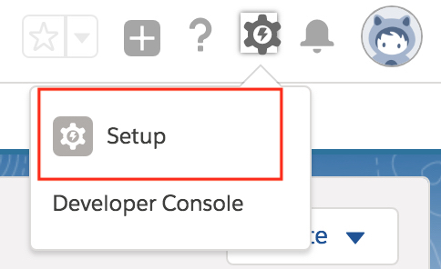
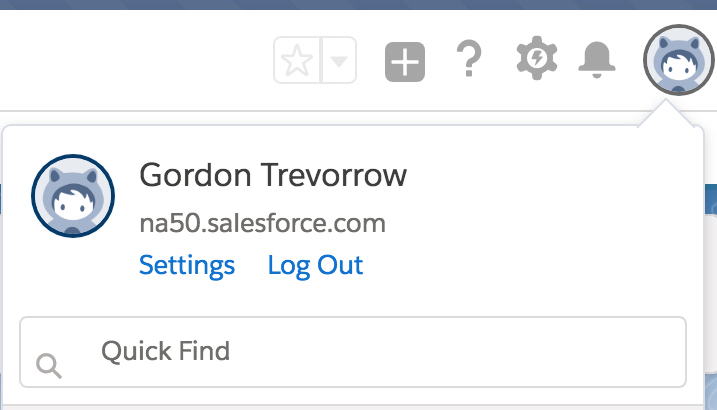
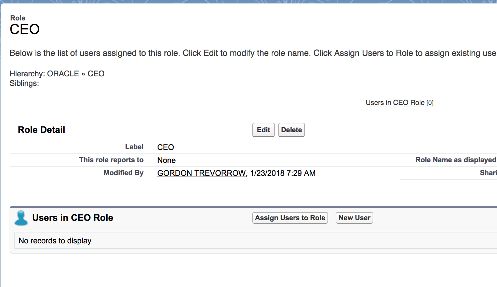
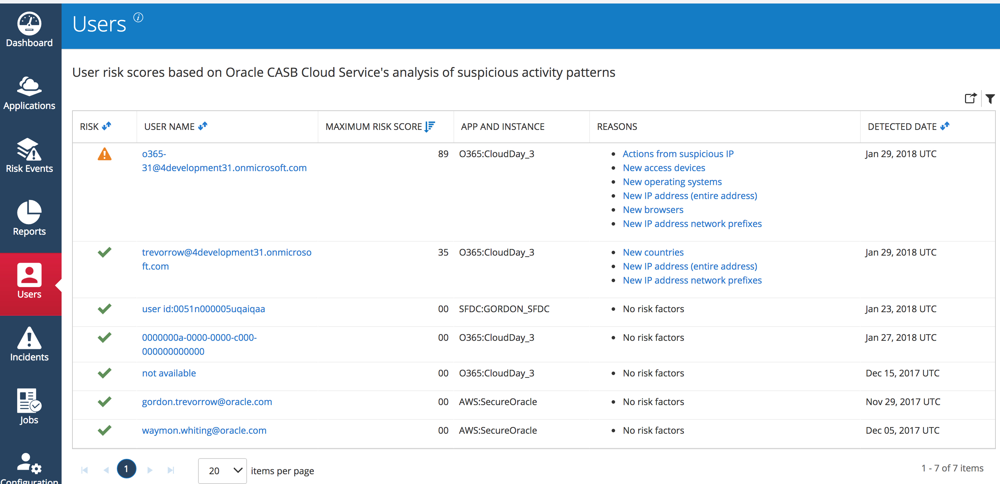
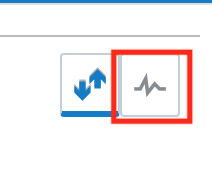

Updated: Feb 16, 2018

## **Introduction**
___
 The purpose of these self-directed exercises is to provide participants hands-on experience using the Oracle CASB Cloud Service trail account to perform some key CASB use cases 

## **Objectives**
___
The exercises will cover the following CASB features and concepts:
 - The CASB Cloud Service Dashboard
 - Sanctioned Application On-boarding
 - Analyzing Security Controls
 - Policies
 - CASB Discovery (Shadow IT)
 - Risk Events & User Risk
 - Event Management
 - Reports

## **Prerequisites**
___

### **Signup for a Salesforce Trial Account**: 

>If you are following these instruction in the context of an Oracle workshop then a Salesforce Developer Account would have been automatically provisioned for you when you signed-up for the workshop. In the event you did not receive a trial account or you are not following these instruction in the context of a workshop then you can self-register for a Salesforce developer account by following these instructions:

#### **STEP 1**: Create Salesforce Developer Account
First, we must acquire a new Salesforce developer account. Sign-up for a Salesforce developer account at https://developer.Salesforce.com/signup (this is a free account, no credit card required). You will need an email address. After completing the signup process, check your email and click the account verification link. The verification link may look similar to this:

 
 After clicking the verification link, next choose a new password for your Salesforce developer account.

#### **STEP 2** Creating a Dedicated Profile in Salesforce
Create a dedicated profile for Oracle CASB Cloud Service in the Salesforce account that you want to monitor.

* In Salesforce, go to "*Setup*" and expand "*Users*", and then select "*Profiles*".

* In the "*Profiles*" page, click "*New Profile*".

* In the "*Clone Profile*" page, find the "*System Administrator*" profile and then give it a name to identify it as the Oracle CASB Cloud Service user profile.

* Click "*Save*".

* In the Profiles page, select the "*new profile*".

* Scroll to the "*Administrative Permissions*" section, and make sure "*API Enabled*" is selected.

#### **STEP 3** Creating a Dedicated Oracle CASB Cloud Service User in Salesforce
Create a dedicated user for Oracle CASB Cloud Service in the Salesforce account that you want to monitor.

>This user must have a direct login to Salesforce or federated authentication through Okta. This Oracle CASB Cloud Service user cannot use multi-factor authentication to access Salesforce.

* In Salesforce, go to "*Setup*" and expand "*Users*".
* In "*Users*", select "*Users*", and then click "*New User*".

* For "*Username*", give the user a unique login ID. This provides a dedicated account for the Oracle CASB Cloud Service user.

* For "*Email*", provide the email address that you want to use to manage the Oracle CASB Cloud Service user (for example, occs@mycompany.com). This account will generate the OAuth token for Oracle CASB Cloud Service.

* In the "*User License list*", select a license type that permits you to use the "*System Administrator profile*" (example: the "*Salesforce*" license).

* In the "*Profile*" list, select the profile that is based on the "*System Administrator profile*". See the procedure above for details.

* Click "*Save*". Salesforce will send a confirmation email to the address that you supplied above.

* Respond to the email from Salesforce to finish setup for the new Oracle CASB Cloud Service user. You need to create a login password and a password retrieval question.

## **Exercise 1. CASB Cloud Service Dashboard**
___
### **Overview**:
This session will familiarize you with the Oracle CASB Cloud Service User Interface and dashboard

### **Exercise**:

#### **STEP 1**: Sign on to Oracle CASB Cloud Service

Using your preferred browser navigate to the Oracle CASB Service home URL at  https://trial.palerra.net/ . 
You'll be presented with the following login form:

  

> If you are following these instructions as part of the Oracle Cloud Security workshop then you'll recieve a registration confirmation e-mail that will contain  CASB  login credentials to a **shared** workshop CASB tenant that will be used in the course of the workshop. **Use the credentials of the shared tenant you recieved to perform this exercise.**

#### **STEP 2**: Review select items on the CASB Dashboard

The Dashboard is the first UI view you will see in the Oracle CASB Cloud Service after you've logged into the service.
The purpose of the dashboard is to give the user a summary view of various important Cloud service security related information. Some of the more important items on the dashboard are:

#### Service Health Indicators

The Health Indicator Carousel presents indicators of the overall health state of the cloud services being monitored by a particular CASB tenant.

There are 5 Health indicator tabs into which the various services being monitored are shorted into:

— Status: Application instance is unreachable.

— High risk level. A threat has been detected.

— Medium risk level. Some items require investigation, but no behavioral threats or malicious IP address accesses.

- Low risk level. Few or no issues require attention.

— Status: You or another administrator recently added this application instance. Oracle CASB Cloud Service is collecting initial data.

#### Health Summary: All App Instances

"*The Health Summary: All Application Instances*" card summarizes potential threat information across all registered application instances. The definitions of the different health and risk indicators listed on this card (e.g. Policy Alerts) will be presented in additional sessions within this workshop.

#### Access Map

The Access Map shows points of origin for both normal (green dot) and suspicious (red dot) events. Click links in the summary information to see more details.

> The other summary cards on the Dashboard Summary tab, such as Suspicious and normal IP addresses, display statistics for specific types of activity that may or may not be suspicious. For each summary card, you can :  View the summary statistics displayed, Hover over parts of the card to see additional information in pop-ups, and to identify links, click any link in the card to see more detailed information, click the Help icon Image of Help icon in the upper-right corner to see online help about the type of information displayed in any particular card.

## **Exercise 2. Sanctioned Application Onboarding**
___
### **Overview**:
In this session, you will be using the Oracle CASB Cloud Service UI to onboard a Salesforce Developer Account into your Oracle CASB Cloud Service tenant. 

### **Exercise**:

#### **STEP 1** Pre-configure your Salesforce Developer Account for this exercise:

Sign into your Salesforce account and navigate to the Setup section. 

 We will configure some sample security settings within Salesforce. In the setup menu, use the upper-left Quick Find box to search for *Password Policies* .

 

Under “*Password Policies*” set user passwords to "*Never Expire*".

Under “*Password Policies*” choose to not enforce password history.

At the bottom of the “*Password Policies*” page, click the "*Save*" button.

**Make sure that you log out from this and other Salesforce accounts and clear the browser cache before continuing with the rest of the exercise.**

#### **STEP 2**: Click on the "*Add an App*" menu item. 
> If you are following these instructions in the context of a workshop you may be signed into CASB, after completing exersise 1 , using the **shared** tenant credentials assigned to you. However, exercise 2 should be performed using **your own Oracle Cloud Trial tenant account** . To accomplish this start a new private browsing window in your browser ( called incognito window in Chrome) and log into https://trial.palerra.net/  with the credentials of your free Oracle Cloud trial account . Now continue with step 2 in your own trial CASB account.

#### **STEP 3**: Choose to add a new Salesforce instance by clicking on the Salesforce icon, and click *Next*.

#### **STEP 4**: Provide the name of the Salesforce instance.

CASB cloud service allows you to add multiple accounts/tenants of any given cloud service as long as each instance has a unique name.
Enter a unique name for the instance for example: *YOURNAME_SFDC*. Set all other values as shown in the following screen capture.
Press the "*Next*" button to proceed to the next step of the "*Register an app instance*" wizard

> If a Salesforce account is federated with a supported Cloud Identity Provider ( IdP ) you can select the "*The users of this app instance log in using single sign-on through an identity provider*" checkbox and select the Identity Provider being used from a list of pre-configured providers

#### **STEP 5**: Select Security Control Monitoring Option

Security controls will be explained in more detail in a later exercise but suffice it to say for now that Enterprise Cloud Applications have security-related settings, such as password complexity requirements and idle session timeouts that Oracle CASB Cloud Service can monitor and change according to a baseline configuration, for a particular Enterprise Cloud Application, that is defined in CASB Cloud Service 

On this screen, we can choose to either:

"*Monitor-only*" in which case Oracle CASB Cloud Service reports on these security control values, but doesn’t change them in the cloud application.

or 

"*Monitor and push*" the preferred values to the cloud application. At registration time, Oracle CASB Cloud Service ensures that your cloud application has your preferred security configuration values. After registration, Oracle CASB Cloud Service reports on changes to these values. 

Select the "*Push controls and monitor*" radio button and then press the "*Next*" button.

#### **STEP 6**: Select "*Standard*" Security Controls Policy

Because the monitor and push option was selected an "*Approval*" radio button will be displayed that will prompt you to acknowledge and consent to CASB Cloud Service making changes in the target service (Salesforce in this case) to bring its security configuration in line with the selected Security Control baseline. 

Click the "*Next*" button 

>You can review the Controls begin monitored and enforced under the *Standard* and *Stringent* Security Controls baselines. You can also define your own security control baseline by clicking on the *Custom* radio button and configuring the security controls you would like to enforce for a given sanctioned app. 

#### **STEP 7**: Authenticate to Salesforce and allow CASB to access your Salesforce Account 
You will be redirected to Salesforce to login, and you will see the following screen in the process:

Use the credentials for the Salesforce tenant that has been assigned to you during the workshop. Upon log in, you will be asked to confirm that you want to grant access to the Oracle CASB Cloud Service:

> If you signed-up for your own Salesforce account use the credentials for the user you created in the Prerequisites section's step 3 in the instructions above. 

>NOTE: Once logged in, Salesforce may ask you to verify your identity by sending a code to the email address used to sign-up. If so, retrieve the one-time verification code from your email. This will not be required if you follow these instructions as part of a workshop where you recieved an assigned Salesforce Developer account. 

> This is part of the Salesforce Authorization code OAuth flow that CASB utilize to gain authorization, (OAuth Access Token) to access the relevant Salesforce APIs it will use to integrate with Salesforce.

Click the *Allow* button to allow the access. You will be redirected back to the Oracle CASB Cloud Service. 

Then click on the "*Done*" button on the following screen that informs you about the data collection delay that you should expect 

Next , click  on   "*Applications*" using the Navigation Bar on the left of the CASB UI .

 CASB will now start the initial data collection for the new application . You can expect this initial data collection to complete within 30 to 120 minutes. While the initial data collection is taking place, the application will be tagged with the “*NEW*” banner in the application list. 

 

>In our testing, the initial data load usually takes approximately 30 minutes to complete.

After the data load has taken place, the application will shed the “*NEW*” banner

#### **STEP 8**: Review changes made in Salesforce to bring it inline with the Security Control baseline we selected.

Recall that we changed the password policy in Salesforce to never expire however notice that the security control we selected with the "*Standard*" baseline requires the password to expire in 90 days. As the Salesforce service is being on-boarded **CASB will access the Salesforce APIs to change the password policy, among many other configuration settings, in Salesforce to comply with the security control baseline we selected in CASB**. You can verify the changes by logging in to Salesforce and navigating to the "*Setup*" menu, then use the upper-left "*Quick Find*" box to search for “*Password Policies*” (no quotes) and review the "*User passwords expire in*" field to verify that it has been **changed back** to expire in 90 days, also notice that the enforce password history has been changed back to "*3 passwords remembered*”. 

#### **STEP 9**: View Risk Events from Initial Scan

**After the initial load is complete**, we can click on the new application. Since we selected to have the CASB Cloud Service push the security control setting to Salesforce the new Salesforce instance should not have any violations and should appear in the low risk services category. 
 
 > If we selected the "*Monitor Only*" option instead of the "*Push Controls and Monitor*" option in step 4 we would have had security control violations appear in the CASB dashboard for the Salesforce tenant after the initial scan. 

## **Exercise 3. Analyze Security Controls**
___
### **Overview**:

Enterprise Cloud Applications have security-related settings, such as password complexity requirements and idle session timeouts. Oracle CASB Cloud Service can detect settings that aren’t strong enough.

Security settings protect both data and users. For example, when users are allowed to keep sessions idle for hours at a time, it increases the risk of their accounts being compromised.

Oracle CASB Cloud Service looks at cloud service configurations and identifies weaknesses in security both up front (at registration time) and on an ongoing basis to identify drift, or gradually increasing deviation, from the ideal configuration. As mentioned in Exercise 2, there are two ways you can configure Oracle CASB Cloud Service to monitor for weak security controls:

Monitor-only. Oracle CASB Cloud Service reports on these security control values, but doesn’t change them in the cloud application.

Monitor and push preferred values to the cloud application. At registration time, Oracle CASB Cloud Service ensures that your cloud application has your preferred security configuration values. After registration, Oracle CASB Cloud Service reports on changes to these values.

### **Exercise**:

We will change the Salesforce Application's security control baseline in a way that will result in security control violations being reported in CASB. We will then review some of the resulting security control violations and finally we will explore how CASB can perform automated remediation of the security control violations. 

>Note that changing the security control baseline, **after** the initial application onboarding completed (with the *Monitor and push* option selected), does NOT result in the configuration changes being pushed from CASB to the Application. We'll see later in the exercise how configuration changes are pushed after the initial onboarding. 

#### **STEP 1: Update Security Control Baseline**
Update the CASB security control baseline for our Salesforce instance. To do so, in your free Cloud Trial account tenant ,  click on "*Applications*", then find your Salesforce instance (use the search icon in the upper-right, if necessary), click on the instance, click on "*Modify*", and then from the drop-down selection choose "*Update Security Control Baseline*". In the next screen, choose to use a “*Stringent*” security control baseline. 

>Expand the Password Policy and Session Settings sections to see more detail on which controls are being enforced by the "*Stringent*" Security control baseline.

Check the Confirmation box that says to “*Use the new threshold values*” and click on the 
"*Submit*" button.

You will now see a message that indicates that the baseline has been updated. Click the "*Done*" icon.

#### **STEP 2**: Review security control violations 

>  As mentioned , there will be a delay between the time the security control baseline is updated until the next scan of the Salesforce tenant's settings will be compared to the new baseline. Any violations will therefore not appear until the next scan takes effect. If you do not see any violations as described below move on to the next exercise and revisit this exercise once CASB has had a chance to do a fresh scan of Salesforce. **If you are following these instructions as part of a workshop you do not have to wait for the next CASB data collection run to take place before you can continue with this exercise. You can sign into the shared CASB tenant and complete the remainder of the exercise in the  shared tenant.** Individual login instructions were provided for each workshop participant. If you did not receive your instructions please inform one of the workshop proctors.

There should be an exclamation point icon in your Salesforce Tenant’s Application List badge indicating there are some new Risk Events we can evaluate for the application. Click, your recently on-boarded, application's badge, and then choose the “*View Details*” button from the "*Health Summary*" popup dialog.

From the details page, a number of non-compliant security controls have been detected.

From the Action menu, note that we could choose to create a new incident based on this particular Risk Event. 

#### **STEP 3** Auto remediate a security control risk event. 

In this step, we'll automatically remediate one of the security control Risk events.

First we'll verify that the "*clickjack*" protection is not enabled in Salesforce:
In Salesforce navigate to *Setup -> Security Controls -> Session Settings* and verify the "*Clickjack Protection*" checkbox is unchecked. 

Select the "*Enable clickjack protection...*" incident in the list of incidents and under the Action column select the "*View incident*" dropdown option.

On the "*View Incident*" dialog select the "*Edit Incident*" button. 

On the "*Edit Incident*" dialog select the "*Resolve*" button.

On the resulting incident dialog ensure that the default "*Auto Remediation*" radio button is selected and click the "*Approval*" radio button and then click on the "*Resolve Incident*" button.

CASB Cloud Service will now invoke the Salesforce API to change the "*Clickjack Protection*" setting in Salesforce to bring it into compliance with the CASB Security Control baseline that is in effect.  

In Salesforce navigate to: *Setup -> Security Controls -> Session Settings* and verify the "*Clickjack Protection*" has been modified in Salesforce.

## **Exercise 4. Policies**
___
### **Overview**:
A policy is a rule or a guideline, such as, "*only people in Finance can view files in the Finance folder*", or "*any change to network access rules must be reviewed*". You can define policies based on particular cloud services, resources in the service, actions on the resource, and optionally items such as actors, recipients, whole groups of users, domains, and IP addresses. In Oracle CASB Cloud Service, you define policies based on:

* Particular cloud services, such as Box, GitHub, or ServiceNow.

* Particular resources in the service, such as a file or folder, or any resource in the service.

* Particular actions on the resource or resources, such as share, download, or collaborate.

* And, optionally, items such as actors, recipients, whole groups of users, domains, and IP addresses.

Oracle CASB Cloud Service generates an alert whenever an event that matches the policy occurs. The console displays a description of the policy violation and can provide recommendations for responding to it. You can also configure the alert to be sent to you over email or SMS.

### **Exercise**:
In this exercise we will define a policy, for Saleforce, that will generate an incident when "*Any*" action is performed on the Salesforce CEO role (This includes adding or removing users to the role). 

#### **STEP 1**: Create a Policy
The basics of a policy consist of these components:

**Actions** that users or administrators perform (for example, creating or deleting)

**Resources** that these users act upon (for example, files, folders, or EC2 instances).

Optionally, you can identify additional filters such as people or groups who perform the action, the IP address of the actor, and the recipient of the action (for actions such as sharing and collaboration).

You can also add instructions for the person who reads the alert. For example, if you create an alert related to deleting access control lists, you can add instructions to inform the group that is responsible for managing the access control lists.

You can set up email notifications when the alert is triggered. This supplement the ability of users to request notifications for all high-risk events in Setting Your Password, Time Zone, and Email Alerting.
#### **STEP 1.1**: In the Oracle CASB Cloud Service console, select Configuration, select "*Policy Management*"

and then click New Policy

#### **STEP 1.2**: Complete the "*Name*" panel in the "*New Policy*" wizard
Choose a unique name of the format “*YOURNAME_TEST_POLICY*” Create a description for the policy, set the priority to "*Medium*", and check the box to “*Include in user risk score.*” This is an example of how a policy can effect user risk scores, thus influencing the CASB machine learning algorithms.

Click on "*Next*".

#### **STEP 1.3**: Complete the "*Resource*" panel 
Select “*Salesforce*” for the application type, choose your Salesforce instance, select “*Role*” as the Resource. And choose a text expression of “*CEO*” for the Resource Name. For the “*Action on this Resource*” leave it set to “*Any*” (although valid choices also include *Assign Role*, *Create Role*, *Delete Role*, *Revoke Role*, and *Update Role*).

After adding this information, click on "*Next*".

#### **STEP 1.4**: (Optional) Complete the "*Username*" panel
You can leave these settings as default (blank) and click the "*Next*" button
> Exception: If the resource action is Login, you identify the user who is logging-in in the previous step (the Resources page) and skip this step.   

#### **STEP 1.5**: Complete the "*Conditions*" panel
Specify conditions to limit when the alert is triggered. 
Add two conditions: one condition for Device equal to "*Desktop*", and a second condition for Device equal to "*Mobile*" (use the “*Add condition*” link to add the second condition). After adding the two policy conditions, click "*Next*" to continue.

> NOTE:
> You can specify a condition using either of these types of conditions multiple times, and you can specify either type of condition in any order, freely mixing the two types.
> When you specify multiple conditions, the conditions operate independently. Each condition causes the alert to either be triggered (Equal To operator), or not be triggered (Not Equal to operator), for that specific condition. The conditions are neither ANDed nor ORed.

#### **STEP 1.6**: Complete the "*Actions*" panel

Create custom instructions for the resultant alert by checking the box for customization and entering a message. Note that alerts can also be sent in email. Click "*Next*".

#### **STEP 1.7**: Click "*Next*" then "*Submit*" on the "*Review & Submit*" dialog

The Policy will appear in the list of policies available for activation for the tenant.

#### **STEP 2**: Trigger the Policy Alert

To test the policy log into the Salesforce account and perform an action on the *CEO* role that our new policy monitors.
 
 Log into your Salesforce Developer account and follow these steps to create a *CEO* role and assign a user to it (This will result in the CASB policy alert)
 
 #### **STEP 2.1**:In the Salesforce "*Setup*" section navigate to *Users -> Roles*
 
 
 Press the "*Set Up Roles*" button

 #### **STEP 2.2**: Select to create the suggested Salesforce Role Hierarchy.

 Select the CEO role 

 

 #### **STEP 2.3**: Select "*Assign Users to Role*" (or "*New User*")
 

 
 
  #### **STEP 2.4**: Add a user to the policy role
 
 Search for a user and add the user to the role by selecting the "*Add*" button to move the user from the search results to the "*Selected Users for CEO*" selection box. 

 > Make sure the user you add to the CEO role is **not** the Service Account user we used to sign-in to Salesforce when we onboarded the application in Exercise 2 . The reason being that CASB Cloud Service will not monitor actions performed by that user so as to ensure that the actions CASB take in the persona of that user, to collect data from Salesforce, does not appear in the data CASB analize.

 Click the "*Save*" button 

>  As noted before there is a delay between data collection cycles for the CASB service and the action you perform in Salesforce might not cause the policy alert in CASB to fire immediately but will appear on the next data collection that CASB does to the Salesforce tenant. **If you are following these instructions as part of a workshop you do not have to wait for the next CASB data collection run to take place before you can continue with this exercise. You can sign into the shared CASB tenant and complete the remainder of the exercise in the shared tenant.** Individual login instructions were provided for each participant if you did not receive your instructions please inform one of the workshop proctors.

#### **STEP 3**: View the policy Alert
Periodically, throughout the duration of the workshop, inspect the Salesforce application's policy alerts to verify that the policy alert associated with the policy you created in STEP 1 did in fact trigger (Refer to the note above concerning the delay in alerts appearing within CASB)  

## **Exercise 5. CASB Discovery**
___
### **Overview**:

We will use Oracle CASB Cloud Service – Discovery to find applications that are not explicitly authorized, but are running in your environment and may present a security threat.

Oracle CASB Cloud Service Discovery allows you to uncover any applications or plug-ins that do not have explicit organizational approval.

### **Exercise**:
#### **STEP 1**: On the CASB Dashboard page select the "*App Discovery*" tab 

#### **STEP 2**: Press the "*Import from Logs*” button 

a Dialog will appear that will prompt the user to upload a log file. 

Press the "*Choose File*" button and upload the sample log file assigned to you.
  
 > The sample log file you should use in this exercise is available for download here.

#### **STEP 3**: Select the log file format & Press the "*Import*" Button

CASB CS will process the log file and update the view with the progress it has made in analyzing the log file. 

Once the file has been processed CASB will display the results of its analysis. You can, at any time, go back to your results by making note of where on the timeline your specific sample log fits in. 

#### **STEP 4**: Explorer the results of the log file import 
At the top of the page CASB will display the users who used the most apps as well as the most popular apps that have been discovered 

You can select one of the users to filter the table view of discovered apps to only include the apps used by the selected user. You can further select individual apps in the table view to view further detail about the app. 

#### **STEP 6** : Explore discovered App/Domain risk factors
For some apps, that have a *SecureScorecard* report, you can view the security concerns associated with the app. 

SecureScorecard evaluates many internet destinations in the context of 10 risk factors:
* Network Security: Checks vendor’s insecure network settings.
* DNS Health: Checks vendor’s DNS insecure configurations and vulnerabilities.
* Patching Cadence: Checks vendor’s software inventory for out of date or vulnerable applications.
* Endpoint Security: Measures security level of vendor’s employee workstations and mobile devices.
* IP Reputation:
Checks suspicious activity, such as malware or spam, in the vendor’s network.
* Web Application Security: A proprietary algorithm that checks for vendor’s implementation of common security best practices.
* Cubit Score: A proprietary algorithm that checks for vendor’s implementation of common security best practices.
* Hacker Chatter: Checks hacker sites for chatter about the vendor.
* Leaked Credentials: Sensitive application information exposed in public code repositories.
* Social Engineering: Measures vendor’s employee awareness to a social engineering or phishing attack.

Select a site, with a SecureScorecard report, and then select a highlighted risk factor to get a more detailed explanation of the risk factor in context of the selected site.

For example, for the bing.com site, in the supplied sample log file, we can see that its Scorecard has an active "*Leaked information*"  risk factor link . Click on the link to get a more detailed explanation of the information that contributed to the risk and its severity. 

#### **STEP 7**: Create a new Incident for one of the discovered apps

Press the "*Create Incident*" action for any one of the apps available in you trial tenant.

Fill out the "*New Incident*" Dialog and click the "*Save*" button.

You'll notice there are 3 new actions available for the app you created an incident for in the CASB App Discovery "*Discovered App*" table view. Mouse over the icons to see a description. Go ahead and explore the new actions that are available.

## **Exercise 6. Risk Events & User Risk**
___
### **Overview**:
Risk events encompass *anomalies* and *threats* that Oracle CASB Cloud Service detects.

Oracle CASB Cloud Service monitors user and agent behavior and automatically generates risk scores and alerts based on their activity patterns. To take advantage of this data, you must find and analyze users at risk, suspicious activity patterns, and activity from suspicious IP addresses.

### **Exercise**:
#### **STEP 1**: Add a blacklisted IP address.
We will demonstrate how to blacklist an IP address. In the Oracle CASB menu (on the left- hand side), click on "*Configuration*" and then click on “*Manage IP addresses*” At the top of the screen you will notice three options: Blacklist, Whitelist, and Exception. In the Blacklist menu, click the “*Add IP Address*” menu item. You can choose to add an Individual Address or an Address Range. In our case, we'll add our own current IP address as an Individual Address.
>To discover your current IP address you can access this [link](https://www.bing.com/search?q=what+is+my+ip)

>Note that the Salesforce instance you'll use on this dialog will be the one you on boarded in Exercise 2.

#### **STEP 2**: Log into Salesforce

When we log into Salesforce from your blacklisted IP we ensure that a future risk event will be generated for Salesforce that flags the access to Salesforce from the black listed IP address. 

#### **STEP 3**: Analyze the resulting risk even starting from the dashboard

>The risk event will appear after the next scheduled data collection has occurred from your Salesforce tenant.  **If you are following these instructions as part of a workshop you do not have to wait for the next CASB data collection run to take place before you can continue with this exercise. You can log into the shared CASB tenant and complete the remainder of the exercise in the shared tenant.**
Individual login instructions were provided for each participant. If you did not receive your instructions please inform one of the workshop proctors.

Risk events that can be mapped to a geographic location (such as those that result from access from blacklisted IP addresses) are flagged on the Dashboard Access Map with red markers. 

Practice drilling down into the risks from a specific location by clicking on the red markers to get to the list of events from that given location marker. 

#### **STEP 4**: Analyze User Risk

Users pose a variety of different security risks that Oracle CASB Cloud Service can detect. The purpose of this step is to understand how to use the User risk levels card to identify high risk users.

#### **STEP 4.1**: Dashboard User Risk Level Card - Click any area of the chart to view details for the users at the corresponding risk level.
In the Dashboard, the User risk levels card provides a quick overview of whether any users of your cloud services have an elevated risk score. The chart is segmented into 3 color coded areas. Green are normal users, Yellow indicate the number of medium risk users and red represent users that are considered high risk. 

Oracle CASB Cloud Service typically collects 10 days of data before creating a risk profile for a user. It then generates a risk score for the user. This score is based on the degree to which the user's actions over the past day (24 hours) has deviated from their typical usage pattern. Oracle CASB Cloud Service does not analyze every action when calculating this risk score. Instead, it looks at actions that are often implicated in malicious insider or external hacker activity.
Typically, the longer Oracle CASB Cloud Service monitors a user's behavior, the more accurate the risk score will be.
Examples of behaviors that can generate a high-risk score:

* Downloading an unusual number of files, or deleting an unusual number of files, from IP addresses that the user had not used in the past.

* Traversing an unusually long geographical distance in a relatively short amount of time, particularly when benchmarked against the user's typical behavior.

* Accessing a cloud service from new IP addresses and locations outside of typical work hours for that user.

* Unusual application-specific activities for the user that might involve sensitive data. For example, In Salesforce, Oracle CASB Cloud Service monitors actions such as changes to security controls (for example, session timeout settings), changes to federated identity providers (known as Security Assertion Markup Language, or SAML providers), mass transfers and deletes, and changes to authentication certificates.

This Dashboard card provides a summary of users and highlights which users are showing normal activity and which users have shown behaviors that puts their account at risk.

> You can also click the report icon in this card (the grid) to view a detailed report of users who are at risk (also accessible from the Users page).

#### **STEP 4.2**: The Users Page - From the admin console, select Users

The Users page provides a risk profile for all users who access the cloud applications or services that Oracle CASB Cloud Service monitors.

Each risk profile is based on activity that Oracle CASB Cloud Service considers atypical. These activities can be generic (for example, an unusually high number of login attempts or access IP addresses) or specific to an application type (for example, sensitive administrative operations that are specific to Amazon Web Services).
For the first ten days that Oracle CASB Cloud Service monitors a user, it bases its risk score on internal benchmarks. After ten days of monitoring a particular user, Oracle CASB Cloud Service bases the risk score on significant changes in the user's behavior, relative to that user's previous behavior. The longer Oracle CASB Cloud Service monitors a user, the more stable Oracle CASB Cloud Service's model of the user becomes. 

Oracle CASB Cloud Service recalculates its risk score daily based on new input and raises or lowers the risk score relative to the new risk factors detected:
Generic factors include the user's locations and IP addresses, file download activity, and number of operating systems used.
Service-specific factors include sharing content with external users; creating, updating, and deleting content; and administrative activity, such as creating, modifying, and deleting users.

> These are the risk ratings in the Users page:

> * High. A risk score of 90 and above is categorized as high risk.

> * Medium. 80-89.

> * Low (some) risk. 60-79.

> * Normal activity. Below 60.

#### **STEP 4.3**: To view all details related to a user's risk score, click the user name.
On the user details page, click a link in the Risk Factors section to view the details related to specific risk factors for a user (for example *Actions from suspicious IP*)

#### **STEP 4.4**: Click on the User Activities Button 

A bar chart that presents the weights of the individual risk factors that contributed to the user's particular risk score will be displayed. 

You can click on the individual sections on the bar chart to drill into the individual risk events associated with the user's chart (presented by date). 

## Exercise 7. Event Management
___
Oracle CASB Cloud Service generates a ticket in the Incidents section of the console whenever it detects a behavioral anomaly. Administrators also can create incident tickets manually.

> Note, this is similar to what we did in Exercises 2 but via a different UI route that entails less steps. 

#### **STEP 1**: Finding a targeting an Incident in the Incidents Page for remediation.
Select one of the Salesforce Security Control related incidents and click the "*remediate*" icon

#### **STEP 2**: Review and remediate the incident
Oracle CASB Cloud Service will open a dialog box with the details of the incident. For security control, related incidents you'll notice an actual value and a recommended value that is prescribed by the current active security control baseline. 
For services, such as Salesforce, that provide APIs to affect the recommended configuration changes in the target service you'll have an option to perform an "*Auto Remediation*" you can also select to perform a "*Manual Remediation*”.  We'll do a manual remediation in this exercise since we've already demonstrated an "*Auto Remediation*" in a previous exercise. 

Supply a description in the "*Reason*" text area of what actions you performed to resolve the incident and click the "*Resolve Incident*" button.

#### **STEP 3**: Expand Filters if filters are not displayed
You can filter by incident ID, application instance name, dates, and additional criteria. 

The category filters are:
* Anomalous activity is related to a threat that has been categorized as atypical user behavior. This is the category you also must assign to the ticket to export it to ServiceNow (see the procedure following this one).

* Security control displays only tickets flagged as pertaining to a security configuration issue. An Oracle CASB Cloud Service administrator manually creates tickets of this type.

* Policy alert displays only tickets flagged as pertaining to a policy alert. An Oracle CASB Cloud Service administrator manually creates tickets of this type.

* Monitoring stopped displays only tickets flagged as pertaining to Oracle CASB Cloud Service being unable to connect to a monitored application instance. An Oracle CASB Cloud Service administrator manually creates tickets of this type.

* Other incident types are specialized versions of anomalous activities (threats).

## **Exercise 6. Reports**
___

