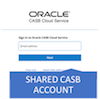

Updated: March 10, 2018

## Introduction
___
 The purpose of these self-directed exercises is to provide participants hands-on experience, using the Oracle CASB Cloud Service trail account, to perform some key CASB use cases. Please ensure that you have completed the Oracle Security Cloud Day [workshop pre-requisites](https://csdoracle.github.io/Cloud-Security-Day/CSD-SETUP.html) before attempting this workshop.

## Objectives
___
The exercises will cover the following CASB features and concepts:
 - Sanctioned Application On-boarding
 - The CASB Cloud Service Dashboard
 - Analyzing Security Controls
 - Policies
 - Risk Events & User Risk
 - Incident Management
 - CASB Discovery (Shadow IT)

## Exercise 1. Sanctioned Application Onboarding
___
### Overview:
In this session, you will be using the Oracle CASB Cloud Service UI to onboard a Salesforce Developer Account into your Oracle CASB Cloud Service tenant to be monitored. We will also configure CASB to update some of the security related settings in Salesforce to bring it in line with a configuration baselines we configured in CASB for Salesforce.

### Exercise:

#### STEP 1: Prepare your assigned Salesforce Developer Account for this exercise by configuring an insecure password policy in Salesforce :

<b>Account</b> 

   

**In a new Private Browsing Tab**, sign in to your Salesforce account at 
secureoracleXXX-dev-ed.lightning.force.com , where XXX is your assigned user number.

<b>LOGIN INSTRUCTIONS:</b> 
 
You may run into the following issues 
  
1. If you are unable to access the Salesforce login form due to an SSL warning in your browser, refer to the printed handout that you received, that contains your Salesforce account credentials and bypass the issue by replacing the hostname "login.saesforce.com" with the assigned host for your user in the format secureoracle__-dev-ed.lightning.force.com . Doing this will circumvent the proxy issues that leads to the SSL issue. 
  
2. After you provide your credentials Salesforce may require you to provide a verification code at this point. Verification codes will be sent to the workshop leader's e-mail account and will be posted on the following <a href="https://cloudsecurityday.blogspot.com">https://cloudsecurityday.blogspot.com.</a>
You can browse the link and find the code for your assigned Salesforce User. 
  
3. You may also be prompted to register your phone number with Salesforce . Select the "I Don't Want to Register My Phone" link 
 

 Once you're in the Salesforce Setup UI Use the upper-left "*Quick Find*" box to search for *Password Policies*.

Under “*Password Policies*” set user passwords to "*Never Expire*".

Under “*Password Policies*” choose to not enforce password history.

At the bottom of the “*Password Policies*” page, click the "*Save*" button.

#### STEP 2: Login to your Oracle  Cloud Trial account and navigate to the Oracle CASB Cloud Service.

<b>Account</b> 

 
 
 

 
  
 
 Start a **new private browsing tab in your browser and log into your Oracle Cloud Trial Account** with the appropriate credentials. Refer to the [workshop re-requisites](https://csdoracle.github.io/Cloud-Security-Day/CSD-SETUP.html) for instruction how to sign in to your Oracle Cloud trial account then go to the cloud "*Dashboard*" to access the trial CASB service.
 
 

 

#### STEP 2: Choose to add a new Salesforce instance by clicking on the Salesforce icon, and click *Next*.

In a new CASB tenant , with no Applications integrated yet, you will start at the "*Applications*"" page with a collection of badges that represent various sanctioned applications that can be integrated with CASB .

#### STEP 3: Provide the name of the Salesforce instance.

CASB cloud service allows you to add multiple accounts/tenants of any given cloud service as long as each instance has a unique name.
Enter a unique name for the instance for example: *SFDC_Userx*. Set all other values as shown in the following screen capture.
Press the "*Next*" button to proceed to the next step of the "*Register an app instance*" wizard

>FYI, If a Salesforce account is federated with a supported Cloud Identity Provider (IdP) you can select the "*The users of this app instance log in using single sign-on through an identity provider*" checkbox and select the Identity Provider being used from a list of pre-configured providers

#### STEP 4: Select Security Control Monitoring Option

<b>Explanation:</b> 
  
Security controls will be explained in more detail in a later exercise but suffice it to say for now that Enterprise Cloud Applications have security-related settings, such as password complexity requirements and idle session timeouts, that Oracle CASB Cloud Service can monitor and change according to a baseline configuration, for a particular Enterprise Cloud Application, that is defined in CASB Cloud Service
  
On this screen, we can choose to either:
  
"<i>Monitor-only</i>" in which case Oracle CASB Cloud Service reports on these security control values, but doesn’t change them in the cloud application.
  
or 
  
"<i>Monitor and push</i>" the preferred values to the cloud application. At registration time, Oracle CASB Cloud Service ensures that your cloud application has your preferred security configuration values. After registration, Oracle CASB Cloud Service reports on changes to these values.

Select the "*Push controls and monitor*" radio button and then press the "*Next*" button.

#### STEP 5: Select "*Standard*" Security Controls Policy

Because the monitor and push option was selected an "*Approval*" radio button will be displayed that will prompt you to acknowledge and consent to CASB Cloud Service making changes in the target service (Salesforce in this case) to bring its security configuration in compliance with the selected Security Control baseline. 

Click the "*Next*" button 

**Optional:** You can review the Controls being monitored and enforced under the *Standard* and *Stringent* Security Controls baselines. You can also define your own security control baseline by clicking on the *Custom* radio button and configuring the security controls you would like to enforce for a given sanctioned app. 

#### STEP 6: Authenticate to Salesforce and allow CASB to access your Salesforce Account 
You will be redirected to Salesforce to login ( a second  time ) , and you will see the following screen in the process:

**Use the credentials for the Salesforce tenant that has been assigned to you during the workshop**. Upon login, you will be asked to confirm that you want to grant access to the Oracle CASB Cloud Service:

FYI, This is part of the Salesforce Authorization Code OAuth flow that CASB utilize to obtain authorization, (OAuth Access Token) to access the relevant Salesforce APIs it will use to integrate with Salesforce. 

Click the *Allow* button to allow the access. (You will be redirected back to the Oracle CASB Cloud Service. 

Then click on the "*Done*" button on the following screen that informs you about the data collection delay that you should expect 

Click on the "*Applications*" navigation option using the Navigation Bar on the left of the CASB UI.

 CASB will now start the initial data collection for the new application . You can expect this initial data collection to complete within 30 to 120 minutes. While the initial data collection is taking place, the application will be tagged with the “*NEW*” banner in the application list. 

 

After the data load has taken place, the application will shed the “*NEW*” banner

#### STEP 7: Review changes made in Salesforce to bring it in line with the Security Control baseline we selected.

Recall that we changed the password policy in Salesforce to *never expire*, however notice that the security control we selected with the "*Standard*" baseline requires the password to expire in 90 days.
As the Salesforce service is being on-boarded **CASB will access the Salesforce APIs to change the password policy, among many other configuration settings, in Salesforce to comply with the security control baseline we selected in CASB**. 

You can verify the changes by logging on to Salesforce and, as in Step 1 of this exercise, navigating to the "*Setup*" menu, then use the upper-left "*Quick Find*" box to search for “*Password Policies*” (no quotes) and review the "*User passwords expire in*" field to verify that it has been **changed back** to expire in 90 days, also notice that the enforce password history has been changed back to "*3 passwords remembered*”. 

Since we selected to have the CASB Cloud Service push the security control setting to Salesforce the new Salesforce instance should not have any violations, **After the initial load is complete**, and should appear in the low risk services category. 
 
 

 FYI, If we selected the "Monitor Only" option instead of the "*Push Controls and Monitor*" option in step 4 we would have had security control violations appear in the CASB dashboard for the Salesforce tenant after the initial scan. 

## Exercise 2. Analyze Security Controls
___
### Overview:

Enterprise Cloud Applications have security-related settings, such as password complexity requirements and idle session timeouts. Oracle CASB Cloud Service can detect settings that aren’t strong enough.

Security settings protect both data and users. For example, when users are allowed to keep sessions idle for hours at a time, it increases the risk of their accounts being compromised.

Oracle CASB Cloud Service looks at cloud service configurations and identifies weaknesses in security both up front (at registration time) and on an ongoing basis to identify drift, or gradually increasing deviation, from the ideal configuration. As mentioned in Exercise 2, there are two ways you can configure Oracle CASB Cloud Service to monitor for weak security controls:

Monitor-only. Oracle CASB Cloud Service reports on these security control values, but doesn’t change them in the cloud application.

Monitor and push preferred values to the cloud application. At registration time, Oracle CASB Cloud Service ensures that your cloud application has your preferred security configuration values. After registration, Oracle CASB Cloud Service reports on changes to these values.

### Exercise:

We will change the Salesforce Application's security control baseline in a way that will result in security control violations being reported in CASB. We will then review some of the resulting security control violations and finally we will explore how CASB can perform automated remediation of the security control violations. 

Note that changing the security control baseline, <b>after</b> the initial application onboarding completed (with the *Monitor and push* option selected), does NOT result in the configuration changes being pushed from CASB to the Application. We will see later in the exercise how configuration changes are pushed after the initial onboarding.

#### STEP 1: Update Security Control Baseline

<b>Account</b>
 

Update the CASB security control baseline for your assigned Salesforce instance. To do so, **in your free Cloud Trial account CASB Service** ( it should already be open in one of your private browsing tabs ),  click on "*Applications*" in the left navigation bar

  

then find your Salesforce instance (use the search icon in the upper-right, if necessary), click on the instance, click on "*Modify*", and then from the drop-down selection choose "*Update Security Control Baseline*".

 In the next screen, choose to use a “*Stringent*” security control baseline. 

**Optional**: Expand the Password Policy and Session Settings sections to see more detail on which controls are being enforced by the "*Stringent*" Security control baseline.

Check the Confirmation box that says to “*Use the new threshold values*” and click on the 
"*Submit*" button.

You will now see a message that indicates that the baseline has been updated. Click the "*Done*" icon.

#### STEP 2: Review security control violations 

 As mentioned , there will be a delay between the time the security control baseline is updated and until the next scan of the Salesforce tenant's settings will be compared to the new baseline. Possible violations will therefore not appear until the next scan takes effect. 

<b>Account</b> 

 

Rather than wait for the scan to complete on your trial tenant  **you can switch back to the shared CASB tenant you used in Exercise 2 at [https://trial.palerra.net/sessions](https://trial.palerra.net/sessions)  and complete the remainder of the exercise in the shared tenant.** As a reminder,
login instructions to the shared tenant were provided to each workshop participant as a seperate handout. If you did not receive your instructions please inform one of the workshop proctors.
#### STEP 2.1: Use the left navigation bar to go to the "*Applications*" view.

There should be an exclamation point icon in your Salesforce Tenant’s Application List badge indicating there are some new Risk Events we can evaluate for the application. 

#### STEP 2.2: Click, on the SalesForce application's badge

Choose the “*View Details*” button from the "*Health Summary*" popup dialog.

#### STEP 2.3: Browse the Security Control Violations
From the details page, a number of non-compliant security controls have been detected.

From the Action menu, note that we could choose to create a new incident based on this particular Risk Event. 

#### STEP 3: Auto remediate a security control risk event. 

#### STEP 3.1: Verify that the "clickjack" protection is not enabled in Salesforce

In this step, we'll automatically remediate one of the security control risk events : .

First we'll verify that the "*clickjack*" protection is not enabled in Salesforce:
With your assigned Salesforce account navigate to *Setup -> Security -> Session Settings* and verify the "*Enable clickjack protection for customer Visualforce pages with standard headers*" checkbox is unchecked. 

#### STEP 3.2: Auto Remediate the Security Control violation

In the shared CASB , select the "*Enable clickjack protection for customer Visualforce pages with standard headers*" incident in the list of incidents and under the Action column select the "*View incident*" dropdown option.

On the "*View Incident*" dialog select the "*Edit Incident*" button. 

On the "*Edit Incident*" dialog select the "*Resolve*" button.

On the resulting incident dialog ensure that the default "*Auto Remediation*" radio button is selected and click the "*Approval*" radio button and then click on the "*Resolve Incident*" button.

FYI, CASB Cloud Service will now invoke the Salesforce API to change the "Clickjack Protection" setting in Salesforce to bring it into compliance with the CASB Security Control baseline that is in effect.

  

#### STEP 3.3: Verify that the "Clickjack" policy has been changed in Salesforce

<b>Account</b> 

   

**In Salesforce** navigate to: *Setup -> Security  -> Session Settings* again and verify the "*Clickjack Protection*" has been modified in Salesforce.

## Exercise 3. CASB Cloud Service Dashboard
___
### Overview:
This session will familiarize you with the Oracle CASB Cloud Service User Interface and dashboard

### Exercise:

#### STEP 1: Sign on to the shared Oracle CASB Cloud Service

<b>Account</b>

 

 

Refer to the handout you received  that will contain CASB login credentials to a shared workshop CASB tenant. **Within a new private browsing tab**, navigate to the shared Oracle CASB Service URL at  [https://trial.palerra.net/sessions](https://trial.palerra.net/sessions)  and **use the credentials of the shared tenant you received to perform this exercise.**

  

FYI , If you are <b>not</b> following these instructions in the context of a workshop and wish to perform some of these exercises on your own then log in to your free Oracle Cloud Trial account and select the "Oracle CASB Cloud Service" from the list of available services. Refer to the <a href="https://csdoracle.github.io/Cloud-Security-Day/CSD-SETUP.html">workshop re-requisites</a> for instruction how to sign in to your Oracle Cloud trial account and access the CASB service. 

#### STEP 2: Review select items on the CASB Dashboard

The purpose of the dashboard is to give the user a summary view of various important Cloud service security related information. Some of the more important items on the dashboard are:

#### Service Health Indicators

The Health Indicator Carousel presents indicators of the overall health state of the cloud services being monitored by a particular CASB tenant.

There are 5 Health indicator tabs into which the various services being monitored are shorted into:

— Status: Application instance is unreachable.

— High risk level. A threat has been detected.

— Medium risk level. Some items require investigation, but no behavioral threats or malicious IP address accesses.

- Low risk level. Few or no issues require attention.

— Status: You or another administrator recently added this application instance. Oracle CASB Cloud Service is collecting initial data.

#### Health Summary: All App Instances

"*The Health Summary: All Application Instances*" card summarizes potential threat information across **all** registered application instances. The definitions of the different health and risk indicators listed on this card (e.g. Policy Alerts) will be presented in additional sessions within this workshop.

#### Access Map

The Access Map shows points of origin for both normal (green dot) and suspicious (red dot) events. Click on the map markers to see more detail about the events associated with a particular geographic location.

Legend : 

 - Indicates a cluster of normal events. Click this symbol to see individual normal events.

- Indicates an individual normal event.

 -Indicates a cluster of suspicious events. Click this symbol to see individual suspicious events.

 - Indicates an individual suspicious event.

FYI, the other summary cards on the Dashboard Summary tab, such as Suspicious and normal IP addresses, display statistics for specific types of activity that may or may not be suspicious. For each summary card, you can:  View the summary statistics displayed, Hover over parts of the card to see additional information in pop-ups, and to identify links, click any link in the card to see more detailed information, click the Help icon Image of Help icon in the upper-right corner to see online help about the type of information displayed in any particular card.

## Exercise 4. Policies
___
### Overview:
A policy is a rule or a guideline, such as, "*only people in Finance can view files in the Finance folder*", or "*any change to network access rules must be reviewed*". You can define policies based on particular cloud services, resources in the service, actions on the resource, and optionally items such as actors, recipients, whole groups of users, domains, and IP addresses. In Oracle CASB Cloud Service, you define policies based on:

* Particular cloud services, such as Box, GitHub, or ServiceNow.

* Particular resources in the service, such as a file or folder, or any resource in the service.

* Particular actions on the resource or resources, such as share, download, or collaborate.

* And, optionally, items such as actors, recipients, whole groups of users, domains, and IP addresses.

Oracle CASB Cloud Service generates an alert whenever an event that matches the policy occurs. The console displays a description of the policy violation and can provide recommendations for responding to it. You can also configure the alert to be sent to you over email or SMS.

### Exercise:
In this exercise we will define a policy, for Salesforce, that will generate an incident when "*Any*" action is performed on the Salesforce CEO role (This includes adding or removing users to the role). 

#### STEP 1: Create a Policy

<b>Explanation:</b>

The basics of a policy consist of these components:
   

<b>Actions</b> that users or administrators perform (for example, creating or deleting)

<b>Resources</b> that these users act upon (for example, files, folders, or EC2 instances).

Optionally, you can identify additional filters such as people or groups who perform the action, the IP address of the actor, and the recipient of the action (for actions such as sharing and collaboration).

You can also add instructions for the person who reads the alert. For example, if you create an alert related to deleting access control lists, you can add instructions to inform the group that is responsible for managing the access control lists.

You can set up email notifications when the alert is triggered. This supplement the ability of users to request notifications for all high-risk events in Setting Your Password, Time Zone, and Email Alerting.

<b>Account</b> 

   >

**Log in to your Oracle Free Trial CASB tenant** [(instructions here)](../Cloud-Security-Day/CSD-SETUP.html)  and perform the following 

#### STEP 1.1: In the Oracle CASB Cloud Service console, select Configuration then select "*Policy Management*"

and then click New Policy

#### STEP 1.2: Complete the "*Name*" panel in the "*New Policy*" wizard
Choose a unique name of the format “*YOURNAME_TEST_POLICY*” Create a description for the policy, set the priority to "*Medium*", and check the box to “*Include in user risk score.*” This is an example of how a policy can effect user risk scores, thus influencing the CASB machine learning algorithms.

Click on "*Next*".

#### STEP 1.3: Complete the "*Resource*" panel 
Select "*Salesforce*" for the "*Application type*", choose your Salesforce instance as your "*Application Instance*", select “*Role*” as the "*Resource*". And choose a text expression of “*CEO*” for the "*Resource Name*". For the “*Action on this Resource*” leave it set to “*Any*” (although valid choices also include Assign Role, Create Role, Delete Role, Revoke Role, and Update Role).

After adding this information, click on "*Next*".

#### STEP 1.4: (Optional) Complete the "*Username*" panel
You can leave these settings as default (blank) and click the "*Next*" button
  

#### STEP 1.5: Complete the "*Conditions*" panel
**Optional** : Specify conditions to limit when the alert is triggered. 
Add two conditions: one condition for Device equal to "*Desktop*", and a second condition for Device equal to "*Mobile*" (use the “*Add condition*” link to add the second condition). After adding the two policy conditions, click "*Next*" to continue.

FYI, You can specify a condition using either of these types of conditions multiple times, and you can specify either type of condition in any order, freely mixing the two types.

When you specify multiple conditions, the conditions operate independently. Each condition causes the alert to either be triggered (Equal To operator), or not be triggered (Not Equal to operator), for that specific condition. The conditions are neither ANDed nor ORed.

#### STEP 1.6: Complete the "*Actions*" panel

Create custom instructions for the resultant alert by checking the box for customization and entering a message. Note that alerts can also be sent in email. Click "*Next*".

#### STEP 1.7: Click "*Next*" then "*Submit*" on the "*Review & Submit*" dialog

The Policy will appear in the list of policies available for activation for the tenant.

#### STEP 2: Trigger the Policy Alert

<b>Account</b> 

To test the policy log in to the Salesforce account and perform an action on the *CEO* role that our new policy monitors.

<b>Note, if you are not following these instructions onsite in an Oracle instructor lead workshop:</b>  
For the workshop you have one assigned Salesforce user which is the same user you used when you on-boarded Salesforce in Exercise 1. 
If you decide to sign-up for your own free Salesforce Developer account and you follow these instructions you should ensure you followed the Salesforce preparation steps described in your workshop handout. These steps prepares a dedicated Salesforce user, for CASB to use to monitor Salesforce. This dedicated Salesforce user should be used in Exercise 1 when you onboard your Salesforce account into CASB outside the context of the instructor lead workshop.  <b>Take note</b>, all other Salesforce instructions in this workshop should be performed with the  Salesforce Admin user that was created when you signed-up for your free Salesforce Developer account . The reason this is important is because CASB will not report on any actions performed by  the Salesforce user that is  dedicated to CASB ( used in Exercise 1 when you on-boarded Salesforce)  and if you perform these steps with that dedicated user the policy described in this exercise will not be triggered. 

 #### STEP 2.1: In the Salesforce "*Setup*" section navigate to *Users -> Roles*
 

 Press the "*Set Up Roles*" button

#### STEP 2.2: Select to create the suggested Salesforce Role Hierarchy.

 Select the "*Assign*" link next to the "*CEO*" role 

 

#### STEP 2.3: Add a user to the policy role

 

 Select the "*Add*" button to move the user from the "*Available Users*" list box to the "*Selected Users for CEO*" list box. 

 Make sure the user you add to the CEO role is **not the Service Account** user we used to sign-in to Salesforce when you on-boarded the application in Exercise 2 . The reason being, as mentioned above,  that CASB Cloud Service will not monitor actions performed by that user so as to ensure that the actions CASB take in the persona of that user, to collect data from Salesforce, does not appear in the data CASB analyze.

 Click the "*Save*" button 

 As noted before there is a delay between data collection cycles for the CASB service and the action you perform in Salesforce might not cause the policy alert in CASB to fire immediately but will appear on the next data collection that CASB does to the Salesforce tenant. If you are following these instructions as part of a workshop you do not have to wait for the next CASB data collection run to take place before you can continue with this exercise. You can use the shared CASB tenant and complete the remainder of the exercise in the shared tenant. Individual login instructions were provided for each participant if you did not receive your instructions please inform one of the workshop proctors.

#### STEP 3: View the policy Alert

<b>Account</b> 

 

In the **shared CASB tenant**, using the "*Applications*" link in the left navigation menu, access the "*Applications*" view.

Click on your assigned Salesforce application to bring up the "*Health Summary*" panel. Click on the "Policy alerts" box as shown in the following screen capture. 

You will be placed in the "*App Details*" drill down view with the risk events filtered to only include "*Policy alerts*". Notice the Policy alert produced by our custom policy . 

## Exercise 5. Risk Events & User Risk
___
### Overview:
Risk events encompass *anomalies* and *threats* that Oracle CASB Cloud Service detects.

Oracle CASB Cloud Service monitors user and agent behavior and automatically generates risk scores and alerts based on their activity patterns. To take advantage of this data, you must find and analyze users at risk, suspicious activity patterns, and activity from suspicious IP addresses.

### Exercise:
#### STEP 1: Add a blacklisted IP address.

<b>Account</b> 

  

In the Oracle CASB navigation menu **of your  Oracle Cloud trial account tenant**, click on "*Configuration*" and then click on “*Manage IP addresses*”. At the top of the screen you will notice three tabs: "*Blacklist*", "*Whitelist*", and "*Exception*". In the "*Blacklist*" tab, click the “*Add IP Address*” menu item. You can choose to add an Individual Address or an Address Range. In our case, we'll add our own current IP address as an Individual Address.

**To discover your current IP address you can access this** [link](https://www.bing.com/search?q=what+is+my+ip)

Note, that the Salesforce instance you will use on this dialog will be the one you on-boarded in Exercise 1.

#### STEP 2: Log in to Salesforce

**IMPORTANT : If you are already logged in to Salesforce ensure you log out of Salesforce first and then log in to Salesforce again.**

When you log in to Salesforce from your blacklisted IP you ensure that a future risk event will be generated for Salesforce that will flag your access to Salesforce from the black listed IP address. 

#### STEP 3: Analyze the resulting risk event starting from the dashboard

The risk event will appear after the next scheduled data collection has occurred for your Salesforce tenant.  If you are following these instructions as part of a workshop you do not have to wait for the next CASB data collection run to take place before you can continue with this exercise. 

<b>Account</b> 

  

**You can log in to the shared CASB tenant and complete the remainder of the exercise in the shared tenant.**
Individual login instructions were provided for each participant. If you did not receive your instructions please inform one of the workshop proctors.

#### STEP 3.1:Using the CASB left navigation menu select "*Dashboard*".

Risk events that can be mapped to a geographic location (such as those that result from access from blacklisted IP addresses) are flagged on the Dashboard Access Map with red markers. 

#### STEP 3.2: Practice drilling down into the risks from a specific location by clicking on the red markers to get to the list of events from that given location marker. 

#### STEP 4: Analyze User Risk

Users pose a variety of different security risks that Oracle CASB Cloud Service can detect. The purpose of this step is to understand how to use the User risk levels card to identify high risk users.

#### STEP 4.1: In the Dashboard "*User Risk Level*" Card  click any area of the chart to view details for the users at the corresponding risk level.

<b>Explanation:</b>

In the Dashboard, the User risk levels card provides a quick overview of whether any users of your cloud services have an elevated risk score. The chart is segmented into 3 color coded areas. Green are normal users, Yellow indicate the number of medium risk users and red represent users that are considered high risk.

Oracle CASB Cloud Service typically collects 10 days of data before creating a risk profile for a user. It then generates a risk score for the user. This score is based on the degree to which the user's actions over the past day (24 hours) has deviated from their typical usage pattern. Oracle CASB Cloud Service does not analyze every action when calculating this risk score. Instead, it looks at actions that are often implicated in malicious insider or external hacker activity.
Typically, the longer Oracle CASB Cloud Service monitors a user's behavior, the more accurate the risk score will be.
Examples of behaviors that can generate a high-risk score:

<li>Downloading an unusual number of files, or deleting an unusual number of files, from IP addresses that the user had not used in the past.
</li>

<li>Traversing an unusually long geographical distance in a relatively short amount of time, particularly when benchmarked against the user's typical behavior.</li>

<li>Accessing a cloud service from new IP addresses and locations outside of typical work hours for that user.</li>

Unusual application-specific activities for the user that might involve sensitive data. For example, In Salesforce, Oracle CASB Cloud Service monitors actions such as changes to security controls (for example, session timeout settings), changes to federated identity providers (known as Security Assertion Markup Language, or SAML providers), mass transfers and deletes, and changes to authentication certificates.

These are the risk ratings in the Users page:

* High. A risk score of 90 and above is categorized as high risk.

* Medium. 80-89.

* Low (some) risk. 60-79.

* Normal activity. Below 60.
#### STEP 4.3: To view all details related to a user's risk score, click the user's name.
On the selected *Users* drill down page, click a link in the Risk Factors section to view the details related to specific risk factors for a user (for example *Actions from suspicious IP*)

#### STEP 4.4: Click on the "*User Risk Score Trending*" Button 

This graph displays the user's risk score as it has changed over the past 30 days:

You can visualize the weights of the individual risk factors that contributed to the user's particular risk score over a 30 day period. 

Click on the individual risk factors on the bar chart to drill into , by date, the individual risk events associated with the selected risk factor on the  user's chart (presented by date). 

## Exercise 6. Incident Management
___
Oracle CASB Cloud Service generates a ticket in the Incidents section of the console whenever it detects a behavioral anomaly. Administrators also can create incident tickets manually.

Incidents are automatically or manually assigned to CASB Cloud Service users.

#### STEP 1: Finding a targeting an Incident in the Incidents Page for remediation.
Select one of the Salesforce Security Control related incidents and click the "*remediate*" icon.

#### STEP 2: Review and remediate the incident
Oracle CASB Cloud Service will open a dialog box with the details of the incident. For security control, related incidents you'll notice an actual value and a recommended value that is prescribed by the current active security control baseline. 
For services, such as Salesforce, that provide APIs to affect the recommended configuration changes in the target service you'll have an option to perform an "*Auto Remediation*" you can also select to perform a "*Manual Remediation*”.  We'll do a manual remediation in this exercise since we've already demonstrated an "*Auto Remediation*" in a previous exercise. 

Supply a description in the "*Reason*" text area of what actions you performed to resolve the incident and click the "*Resolve Incident*" button.

#### STEP 3: Expand Filters if filters are not displayed
You can filter by incident ID, application instance name, dates, and additional criteria. 

<b>Explanation:</b> 

The category filters are:

<li>Anomalous activity is related to a threat that has been categorized as atypical user behavior. This is the category you also must assign to the ticket to export it to ServiceNow (see the procedure following this one).</li>

<li>Security control displays only tickets flagged as pertaining to a security configuration issue. An Oracle CASB Cloud Service administrator manually creates tickets of this type.</li>

<li>Policy alert displays only tickets flagged as pertaining to a policy alert. An Oracle CASB Cloud Service administrator manually creates tickets of this type.</li>

<li>Monitoring stopped displays only tickets flagged as pertaining to Oracle CASB Cloud Service being unable to connect to a monitored application instance. An Oracle CASB Cloud Service administrator manually creates tickets of this type.</li>

<li>Other incident types are specialized versions of anomalous activities (threats).</li>

## Exercise 7. CASB Discovery
___
### Overview:

We will use Oracle CASB Cloud Service – Discovery to find applications that are not explicitly authorized, but are being used in your organization, that may present a security threat.

Oracle CASB Cloud Service Discovery allows you to uncover any applications or plug-ins that do not have explicit organizational approval.

<b>Note:</b> CASB Discovery is not enabled in Oracle Cloud Trial Accounts therefor the App Discovery tab shown in the screenshot bellow will not appear in your trial account . The instructor will use the shared tenant to perform the shadow IT Discovery exercise in the workshop.

### Exercise:

<b>Account</b> 

 

**This Exercise will be performed by the workshop leader**:   
#### STEP 1: On the CASB Dashboard page select the "*App Discovery*" tab 

#### STEP 2: Press the "*Import from Logs*” button 

a Dialog will appear that will prompt the user to upload a log file. 

Press the "*Choose File*" button and upload the sample log file assigned to you.
  
 The sample log file you should use in this exercise is available for download [here](docs/CASBDiscovery-import.log). Right click on the link and save the file to your local machine and make a note where you save it since you'll be required to upload the file to CASB Cloud Service in the course of this exercise.

#### STEP 3: Select the log file format & Press the "*Import*" Button

CASB CS will process the log file and update the view with the progress it has made in analyzing the log file. 

Once the file has been processed CASB will display the results of its analysis.

#### STEP 4: Explorer the results of the log file import 
At the top of the page CASB will display the users who used the most apps as well as the most popular apps that have been discovered 

You can select one of the users to filter the table view of discovered apps to only include the apps used by the selected user. You can further select individual apps in the table view to view further detail about the app. 

#### STEP 6: Explore discovered App/Domain risk factors
For some apps, that have a *SecureScorecard* report, you can view the security concerns associated with the app. 

<b>Explanation:</b>

<li>SecureScorecard evaluates many internet destinations in the context of 10 risk factors:</li>

<li>Network Security: Checks vendor’s insecure network settings.</li>

<li>DNS Health: Checks vendor’s DNS insecure configurations and vulnerabilities.</li>

<li>Patching Cadence: Checks vendor’s software inventory for out of date or vulnerable applications.</li>

<li>Endpoint Security: Measures security level of vendor’s employee workstations and mobile devices.</li>

<li>IP Reputation:
Checks suspicious activity, such as malware or spam, in the vendor’s network.</li>

<li>Web Application Security: A proprietary algorithm that checks for vendor’s implementation of common security best practices.</li>

<li>Cubit Score: A proprietary algorithm that checks for vendor’s implementation of common security best practices.</li>

<li>Hacker Chatter: Checks hacker sites for chatter about the vendor.</li>

<li>Leaked Credentials: Sensitive application information exposed in public code repositories.</li>

<li>Social Engineering: Measures vendor’s employee awareness to a social engineering or phishing attack.</li>

Select a site, with a SecureScorecard report, and then select a highlighted risk factor to get a more detailed explanation of the risk factor in context of the selected site.

For example, for the bing.com site, in the supplied sample log file, we can see that its Scorecard has an active "*Leaked information*” risk factor link . Click on the link to get a more detailed explanation of the information that contributed to the risk and its severity. 

#### STEP 7: Create a new Incident for one of the discovered apps

Press the "*Create Incident*" action for any one of the apps available in you trial tenant.

Fill out the "*New Incident*" Dialog and click the "*Save*" button.

You'll notice there are 3 new actions available for the app you created an incident for in the CASB App Discovery "*Discovered App*" table view. Mouse over the icons to see a description. Go ahead and explore the new actions that are available.

