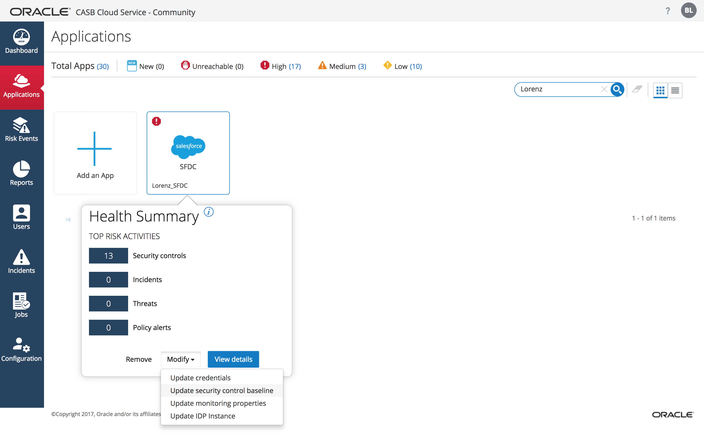
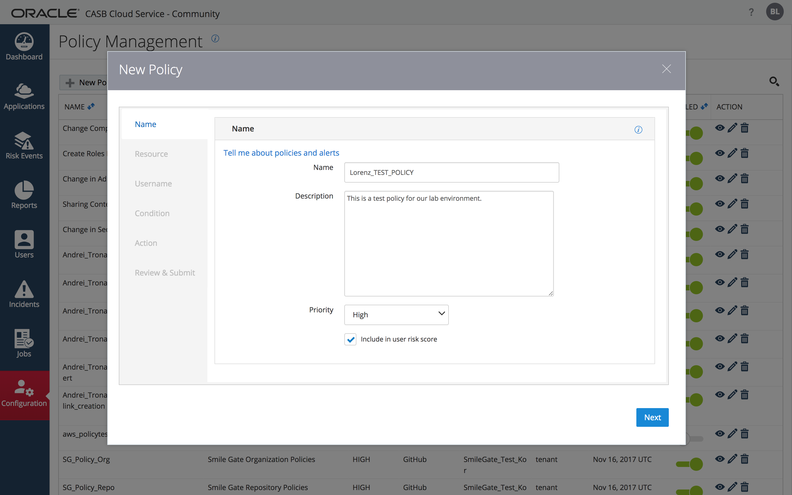
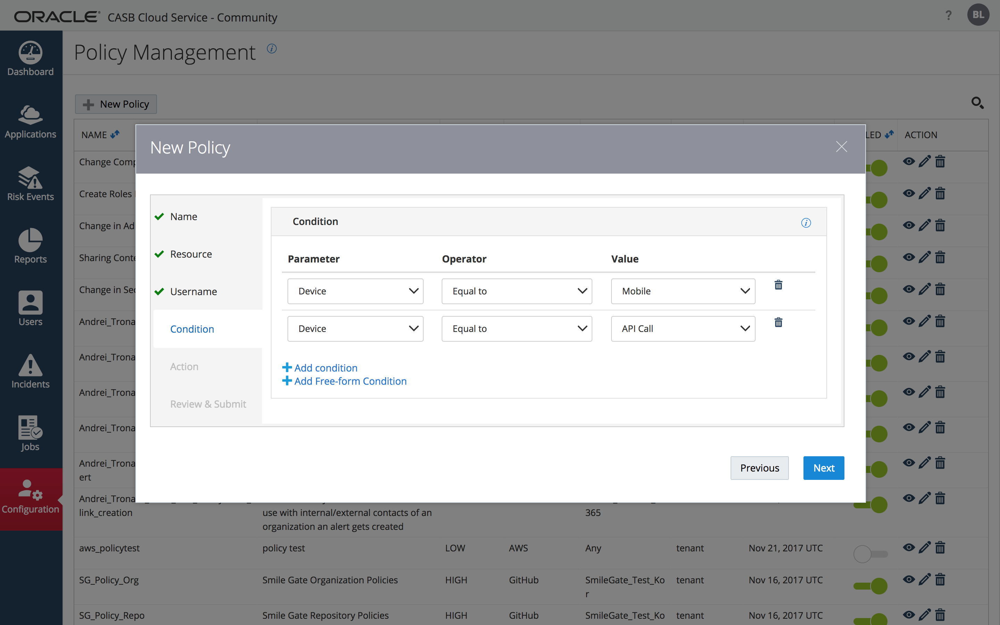
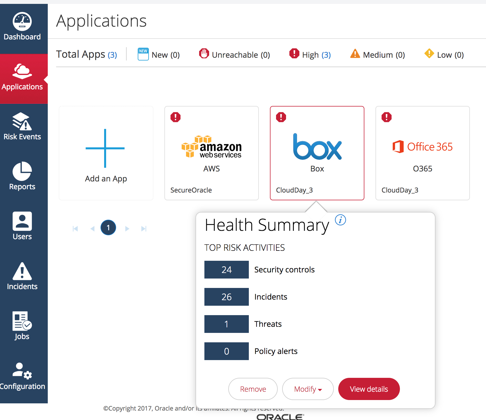

Update: November 13, 2017
___
## Introduction
___
 The purpose of this workshop is to introduce the participants to the Oracle CASB service by means of a x hr long hands-on experience. 
___
## Objectives
___
The workshop will cover the following CASB features and concepts:
 - The CASB Cloud Service Dashboard
 - Sactioned Application Onboarding   
 - CASB Discovery (Shadow IT)
 - Policies
 - Risk Events & User Risk
 - Security Controls
 - Event Management

___
## Workshop Prerequisites
___

Upon registering for the workshop itself you would have recieved a  registration confirmation e-mail that contains a link to the workshop's shared folder as well as CASB account credentials and instructions on how to sign up for a Oracle cloud free trial. 

### **Signup for a Sales Force Trial Account**: 

### **STEP 1**: Create Salesforce Developer Account
First, we must acquire a new Salesforce developer account. Sign-up for a Salesforce developer account at https://developer.salesforce.com/signup/success (this is a free account, no credit card required). You will need an email address. After completing the signup process, check your email and click the account verification link. The verification link may look similar to this:

### **STEP 2** Configure Salesforce Developer Account for CASB:
After clicking the verification link, next choose a new password for your Salesforce developer account. You will next be taken to the Salesforce dashboard where you can configure settings. We’ll use this opportunity to configure some sample security settings within Salesforce. In the setup menu, use the upper-left Quick Find box to search for “Password Policies” (no quotes).

Under “Password Policies,” set user passwords to Never Expire.

Under “Password Policies,” choose to not enforce password history.

At the bottom of the “Password Policies” page, click the Save button. This completes our tutorial of creating a Salesforce demo instance and setting some sample Salesforce security policies. There are many security settings within Salesforce that can be protected with CASB, but this is just a sample. Note how easy it is for administrators to modify the security settings.

___
## CASB Cloud Service Dashboard
___
### **STEP 1**: Sign on to Oracle CASB Cloud Service

- Using your favorite browser navigate to the Oracle CASB Service home URL at  https://trial.palerra.net/ . You'll be presented with the following login form 

      

> Your registration confirmation e-mail contains your CASB administrator login credentials.

### **STEP 2**: Review select items on the CASB Dashboard

The Dashboard is the first thing you see in the Oracle CASB Cloud Service after you've logged into the service.
The purpose of the dashboard is to give the user a summary view of various important Cloud service security related information

#### Service Health Indicators
The Health Indicator Carousel presents indicators of the overall health state of the cloud services being monitored by the particular CASB tenant.

— Status: Application instance is unreachable.

— High risk level. A threat has been detected.

— Medium risk level. Some items require investigation, but no behavioral threats or malicious IP address accesses.

- Low risk level. Few or no issues require attention.

— Status: You or another administrator recently added this application instance. Oracle CASB Cloud Service is collecting initial data.

#### Health Summary: All App Instances

The Health Summary: All Application Instances card summarizes potential threat information across all registered application instances.

#### Access Map

The Access Map shows points of origin for both normal (green dot) and suspicious (red dot) events. Click links in the summary information to see more details.

> *The other summary cards on the Dashboard Summary tab, such as Suspicious and normal IP addresses, display statistics for specific types of activity that may or may not be suspicious. For each summary card, you can:*

> -*View the summary statistics displayed.*

> -*Hover over parts of the card to see additional information in pop-ups, and to identify links.*

> -*Click any link in the card to see more detailed information.*

> -*Click the Help icon Image of Help icon in the upper-right corner to see online help about the type of information displayed in the card.*

___

## Sactioned Application Onboarding
___
> NOTE: *This section requires that you've completed the [pre-requisite](#step-1-create-salesforce-developer-account) step of signing up for an SaleForce free developer account*

### **STEP 1**: Click on the "Add an App" menu item. 

### **STEP 2**: Choose to add a new Salesforce instance by clicking on the Salesforce icon, and click Next.

### **STEP 3**: Provide the name of the SalesForce instance.

CASB cloud service allows you to add multiple accounts /tenants of any given cloud service as long as each instance has a unique name
Enter a unique name for the instance of the format: “YOURNAME_SFDC” (without the quotes). Leave all other values to their default as shown.
Press the "Next" button to proceed to the next step of the "Register an app instance" wizard

> *Note :  If your SalesForce account is federated with a supported Cloud Identity Provider ( IdP ) you can select the "The users of this app instance log in using single sign-on through an identity provider" checkbox and select the Identity Provider being used from a list of pre-configured providers*

### **STEP 4**: Select Monitoring Type

Choose "Push controls and monitor"

### **STEP 5**:  Select Security Controls

### **STEP 6**: Authenticate to SalesForce and allow CASB to access you Salesforce Account 
You will next be sent to SFDC to login, and you will see the following screen in the process:

You will then be redirected to Salesforce, where you will login using your username/password.
> NOTE: *Once logged in, Salesforce may  ask you to verify your identity by sending a code to the email address used to sign-up. If so, retrieve the one time verification code from your email.*

Upon logging in, you will be asked to confirm that you want to grant access to the Oracle CASB:

> NOTE : This is part of  the Salesforce Authorzation code OAuth Flow that CASB utilize to gain permissions to access the relevant SalesForce APIs it will use.

Click the Allow button to allow the access.
You will next be redirected back to the Oracle CASB application. Here, you receive confirmation that the application is on-boarded and the initial data load will complete within 30 to 120 minutes. In our testing, the initial data load usually takes about 30 minutes to complete.

While the load is taking place, the application will have a “NEW” banner in the application list.

After the data load has taken place, the application will shed the “NEW” banner, like so.

### **STEP7**: View Risk Events from Initial Scan

Now that the load is complete, we can click on the new application. Note it will have an exclamation point in its Application List icon, indicating there are some new Risk Events we can evaluate. Click the newly on-boarded application, and then choose to “View Details”.

From the details page, a number of non-compliant security controls have been detected.

Note that the Risk Event was detected by the Initial Service Scan. From the Action menu, note that we could choose to Create a new incident based on this particular Risk Event. This completes the application onboarding process and a quick tour of CASB’s initial scan data.

### **STEP8**: Update Security Control Baseline
Next, we’ll update the CASB security control baseline for our Salesforce instance, so that it matches Example Company’s approved baseline. To do so, first click on Applications, then find your Salesforce instance (use the search icon in the upper-right, if necessary), click on the instance, click on Modify, and then from the selection choose Update Security Control Baseline.

In the next screen, choose to use a “Custom” security control baseline, and then expand the Password Policies and Session Settings sections. Within each of these two sections, choose to configure the “New alerting threshold” to match the “Current cloud settings” for each setting.

Check the box that says to “use the new threshold values” and click on the Submit button.

You will now see a message that indicates baseline has been updated. Click the Done icon.
These baselines can be customized as needed and will take effect for future application scans.
___
## CASB Discovery
___

> NOTE : The section of the workshop should be performed using the CASB tenant you recieved credentails for when you signed up for a free Oracle Cloud Trial. 

### **STEP 1**: On the CASB Dashboard view select the "App Discovery" tab 

### **STEP 2**: Press the "Import from Logs” button 

a Dialog will appear that will prompt the user to upload a log file. 

#### **STEP 2.1**: Press the "Import from Logs” button 
Press the "Choose File" button and upload the sample log file assigned to you 

 > *Note : Each workshop participant  received a sample logfile that has been uploaded to the individual Box folder 

#### **STEP 2.2**: Select the log file format & Press the "Import" Button

CASB CS will process the log file and update the view with the progress it has made in analizing the log file. 

Once the file has been processed CASB will display the results of it's analysis. You can, at any time, go back to your results by making note of where on the timeline your specific sample log fits in. 

> *Note : You will see the results of all the participants' sample log files since all participants share one single CASB tenant for the workshop.* 

#### **STEP 3**: Explorer the results of the log file import 
At the top of the page CASB will display the users who used the most apps as well as the most popular apps that have been discovered 

You can select one of the users to filter the table view of discovered apps to only include the apps used by the selected user . You can further select individual apps in the table view to view further detail about the app . For some apps that have a *SecureScorecard* report you can view the  security concerns associated with the app . 

#### **STEP 4**: Create a new Incident for one of the discovered apps

Press the Create Incident action for one of the apps

Fill out the New Incident Dialog and submit

You'll notice there are 3 new actions available for the app in the CASB App Discovery "Discovered App" table view. Mouse over the icons to see a description. Go ahead and explore the new actions that are available.
___
## Policies
___
A policy is a rule or a guideline, such as, "only people in Finance can view files in the Finance folder", or "any change to network access rules must be reviewed.". You can define policies based on particular cloud services, resources in the service, actions on the resource, and optionally items such as actors, recipients, whole groups of users, domains, and IP addresses. In Oracle CASB Cloud Service, you define policies based on:

* Particular cloud services, such as Box, GitHub, or ServiceNow.

* Particular resources in the service, such as a file or folder, or any resource in the service.

* Particular actions on the resource or resources, such as share, download, or collaborate.

* And, optionally, items such as actors, recipients, whole groups of users, domains, and IP addresses.

Oracle CASB Cloud Service generates an alert whenever an event that matches the policy occurs. The console displays a description of the policy violation and can provide recommendations for responding to it. You can also configure the alert to be sent to you over email or SMS.

### **STEP 1**: Create a Policy
The basics of a policy consist of these components:

**Actions** that users or administrators perform (for example, creating or deleting)

**Resources** that these users act upon (for example, files, folders, or EC2 instances).

Optionally, you can identify additional filters such as people or groups who perform the action, the IP address of the actor, and the recipient of the action (for actions such as sharing and collaboration).

You can also add instructions for the person who reads the alert. For example, if you create an alert related to deleting access control lists, you can add instructions to inform the group that is responsible for managing the access control lists.

You can set up email notifications when the alert is triggered. This supplement the ability of users to request notifications for all high-risk events in Setting Your Password, Time Zone, and Email Alerting.
#### **STEP 1.1**: In the Oracle CASB Cloud Service console, select Configuration, select Policy Management.

and then click New Policy

#### **STEP 1.2**: Complete the "Name" panel in the "New Policy' wizzard
Choose a unique name of the format “YOURNAME_TEST_POLICY.” Create a description for the policy, set the priority to High, and check the box to “Include in user risk score.” This is an example of how a policy can effect user risk scores, thus influencing the CASB machine learning algorithms.

Click on Next.
#### **STEP 1.3**: Complete the "Resource" panel 
Select “Salesforce” for the application type, choose your Salesforce instance, select “Role” as the Resource. And choose a text expression of “CEO” for the Resource Name. For the “Action on this Resource,” leave it set to “Any” (although valid choices also include Assign Role, Create Role, Delete Role, Revoke Role, and Update Role).

After adding this information, click on Next.
#### **STEP 1.4**: (Optional) Complete the "Username" panel
You can leave these settings as default (blank) and click the Next button
> *Exception: If the resource action is Login, you identify the user who is logging in in the previous step (the Resources page) and skip this step.*   

#### **STEP 1.5**: Complete the "Conditions" panel
Specify conditions to limit when the alert is triggered. 
Add two conditions: one condition for Device equal to Mobile, and a second condition for Device equal to API Call (use the “Add condition” link to add the second condition). After adding the two policy conditions, click Next to continue.

> *NOTE:*
> *You can specify a condition using either of these types of conditions multiple times, and you can specify either type of condition in any order, freely mixing the two types.*
> *When you specify multiple conditions, the conditions operate independently. Each condition causes the alert to either be triggered (Equal To operator), or not be triggered (Not Equal to operator), for that specific condition. The conditions are neither ANDed nor ORed.*

#### **STEP 1.6**: Complete the "Actions" panel

Create custom instructions for the resultant alert by checking the box for customization and entering a message. Note that alerts can also be sent in email. Click Next.

#### **STEP 1.7**: Click "Next" and "Review & Submit" the policy 

The Policy will appear in the list of policies available for activation for the tenant.

### **STEP 2**: Trigger the Policy Alert

To test the policy log into the SalesForce account and perform an acction on the role focused on in the policy . 
>  *Note: 
>  There is a delay between data collection cycles for the CASB service and the action you perform in SalesForce might not cause the policy alert in CASB to fire immediately but will appear on the next data collection that CASB does to the SalesForce tenant*

### **STEP 3**: View the policy Alert
Periodically, throughout the duration of the workshop, inspect the box application's policy alerts to verify that the policy alert associated with the policy you created in STEP 1 did in fact trigger ( Refer to the note above concerning the delay in alerts appearing within CASB )  
___
## Risk Events & User Risk
___
Risk events encompass *anomalies* and *threats* that Oracle CASB Cloud Service detects.

Oracle CASB Cloud Service monitors user and agent behavior and automatically generates risk scores and alerts based on their activity patterns. To take advantage of this data, you must find and analyze users at risk, suspicious activity patterns, and activity from suspicious IP addresses.

### **STEP 1**: Add a blacklisted IP address .
Next, we will demonstrate how to blacklist an IP address. In the Oracle CASB menu (on the left- hand side), click on configuration and then click on “Manage IP addresses.” At the top of the screen you will notice three options: Blacklist, Whitelist, and Exception. In the Blacklist menu, click the “Add IP Address” menu item. You can choose to add an Individual Address or an Address Range. In our case, let’s add a sample IP address for as an Individual Address, like so:

### **STEP 2**: Log into SalesForce

### **STEP 3**: Analyze the resulting risk even starting from the dashboard

#### **STEP 3.1**: View the event on the "Access Map"

#### **STEP 3.2**: Find the risk events for SalesForce starting with health cards on the dashboard

### **STEP 4**: Analyze User Risk

Users pose a variety of different security risks that Oracle CASB Cloud Service can detect. The purpose of this step is to Understand how to use the User risk levels card to identify high risk users.
#### **STEP 4.1**: Dashboard User Risk Level Card - Click any area of the chart to view details for the users at the corresponding risk level.
In the Dashboard, the User risk levels card provides a quick overview of whether any users of your cloud services have an elevated risk score.

Oracle CASB Cloud Service typically collects 10 days of data before creating a risk profile for a user. It then generates a risk score for the user. This score is based on the degree to which the user's actions over the past day (24 hours) has deviated from their typical usage pattern. Oracle CASB Cloud Service does not analyze every action when calculating this risk score. Instead, it looks at actions that are often implicated in malicious insider or external hacker activity.
Typically, the longer Oracle CASB Cloud Service monitors a user's behavior, the more accurate the risk score will be.
Examples of behaviors that can generate a high-risk score:

* Downloading an unusual number of files, or deleting an unusual number of files, from IP addresses that the user had not used in the past.

* Traversing an unusually long geographical distance in a relatively short amount of time, particularly when benchmarked against the user's typical behavior.

* Accessing a cloud service from new IP addresses and locations outside of typical work hours for that user.

* Unusual application-specific activities for the user that might involve sensitive data. For example, In Salesforce, Oracle CASB Cloud Service monitors actions such as changes to security controls (for example, session timeout settings), changes to federated identity providers (known as Security Assertion Markup Language, or SAML providers), mass transfers and deletes, and changes to authentication certificates.

This Dashboard card provides a summary of users and highlights which users are showing normal activity and which users have shown behaviors that puts their account at risk.

> You can also click the report icon in this card (the grid) to view a detailed report of users who are at risk (also accessible from the Users page).

#### **STEP 4.2**: The Users Page - From the admin console, select Users
The Users page provides a risk profile for all users who access the cloud applications or services that Oracle CASB Cloud Service monitors.

Each risk profile is based on activity that Oracle CASB Cloud Service considers atypical. These activities can be generic (for example, an unusually high number of login attempts or access IP addresses) or specific to an application type (for example, sensitive administrative operations that are specific to Amazon Web Services).
For the first ten days that Oracle CASB Cloud Service monitors a user, it bases its risk score on internal benchmarks. After ten days of monitoring a particular user, Oracle CASB Cloud Service bases the risk score on significant changes in the user's behavior, relative to that user's previous behavior. The longer Oracle CASB Cloud Service monitors a user, the more stable Oracle CASB Cloud Service's model of the user becomes. Oracle CASB Cloud Service recalculates its risk score daily based on new input and raises or lowers the risk score relative to the new risk factors detected:
Generic factors include the user's locations and IP addresses, file download activity, and number of operating systems used.
Service-specific factors include sharing content with external users; creating, updating, and deleting content; and administrative activity, such as creating, modifying, and deleting users.

> These are the risk ratings in the Users page:

> * High. A risk score of 90 and above is categorized as high risk.

> * Medium. 80-89.

> * Low (some) risk. 60-79.

> * Normal activity. Below 60.

#### **STEP 4.3**: To view details related to an individual risk factor for a user, click the risk factor name (for example, Failed login IP addresses).
#### **STEP 4.4**: To view all details related to a user's risk score, click the user name.
#### **STEP 4.5**: On the user details page, click a link in the Risk Factors section to view the details related to specific risk factors for a user.
#### **STEP 4.6**: Click the See More link at the bottom of the table, and in the risk factor details dialog box, page through all of the events related to the risk factor.
#### **STEP 4.7**: View a report of all activity related to a user

___
## Security Controls
___
The purpose of this section of the workshop is to locate and resolve security control issues in Risk Events.

Some of the risks that Oracle CASB Cloud Service detects are related to non-conforming security configuration values. Oracle CASB Cloud Service alerts you when it detects non-conforming security configuration values, for example, the minimum password length or the length of time a user's session can be idle before an automatic timeout.

To respond to a security control alert, you can either update the setting in the cloud application manually, or in some cases, you can have Oracle CASB Cloud Service perform the update on your behalf.

### **STEP 1**: From the Dashboard, click the “Non-compliant security controls” number in the Health Summary card
This presents a view of non-compliant security alerts for all applications on the Risk Events page 

 (CATEGORY column lists only “Security control” entries).
 

### **STEP 2**: From the Applications page, to view all non-compliant security alerts for a single application on the Risk Events page:
In card view, click an application tile to see the Health Summary card for that application, then click the “Security controls” number.

On the Risk Events page, view the description of the non-compliant security control that triggered the alert in the SUMMARY column for the alert.
The SUMMARY column displays the label for the security control as it appears in the related application or service. For example, Box has these security controls:

### **STEP 3**: Click any row in the risk events list to view details about the security control risk, including its current value and Oracle CASB Cloud Service's recommended value.
For example, if a cloud application only requires 5 characters in a password, the recommended value might be 10 characters. The recommended value is Oracle CASB Cloud Service's baseline:

>*Note:*
>*If you register a cloud application instance in monitor-only mode, Oracle CASB Cloud Service uses its own stringent settings as the baseline.*
>*If you register an application in Push Controls mode, Oracle CASB Cloud Service sets your preferred values in the cloud application and then generates an alert if anyone modifies that value in the cloud application.*

### **STEP 4**: Create a Ticket
Click the Actions drop-down menu & click Create incident. Oracle CASB Cloud Service populates the incident ticket with information from the risk event, and you can add details about the incident. When you are done, click New incident. Oracle CASB Cloud Service creates a new incident ticket which you can track to completion in Tracking Incident Tickets.

If you feel the risk does not merit attention at this time, click Dismiss. To prevent Oracle CASB Cloud Service from generating additional alerts about this risk, you can update the security control baseline for this application instance. See Updating the Security Control Baseline for an Application Instance in the CAB documentation set for instructions on how to update the Security Control Baseline.
### **STEP 5**: Pushing Security Control Values to an Application Instance
You can have Oracle CASB Cloud Service actually set configuration values in an AWS, Box, or Salesforce application instance.

By default, Oracle CASB Cloud Service automatically notifies you if a registered cloud application or service has security control settings that should be strengthened to comply with best practices. For example, it automatically sets the password minimum length control in the application to make sure that this value meets a baseline value.

With AWS, Box, and Salesforce application instances, you can also have Oracle CASB Cloud Service set the configuration values.
[TO DO ADD INSTRUCTIONS FOR BOX AND OR SF]

___
## Event Management
___
Oracle CASB Cloud Service generates a ticket in the Incidents section of the console whenever it detects a behavioral anomaly. Administrators also can create incident tickets manually.
### **STEP 1**: Finding an Incident in the Incidents Page
#### **STEP 1.1**: Click "Incidents" in the left navigation pane
#### **STEP 1.2**: Expand Filters if filters are not displayed
You can filter by incident ID, application instance name, dates, and additional criteria. 

The category filters are:
* Anomalous activity is related to a threat that has been categorized as atypical user behavior. This is the category you also must assign to the ticket to export it to ServiceNow (see the procedure following this one).

* Security control displays only tickets flagged as pertaining to a security configuration issue. An Oracle CASB Cloud Service administrator manually creates tickets of this type.

* Policy alert displays only tickets flagged as pertaining to a policy alert. An Oracle CASB Cloud Service administrator manually creates tickets of this type.

* Monitoring stopped displays only tickets flagged as pertaining to Oracle CASB Cloud Service being unable to connect to a monitored application instance. An Oracle CASB Cloud Service administrator manually creates tickets of this type.

* Other incident types are specialized versions of anomalous activities (threats).

#### **STEP 1.3**: Click Search

#### **STEP 1.4**: Click the Edit icon to view the details for an incident of interest.

### **STEP 2**: Resolve an Incident
#### **STEP 2.1**: In the Oracle CASB Cloud Service console, select Incidents

#### **STEP 2.2**: Click the Edit icon to view incident details 
#### **STEP 2.3**: In the Edit Incident dialog - Click Resolve.

##### **STEP 2.3.1** : In the Incident#... dialog, if Oracle CASB Cloud Service or another system can resolve the incident automatically, the Auto remediation option is available. To delegate remediation to Oracle CASB Cloud Service, select Auto remediation.

If the Auto remediation option is not available, or you wish to fix the Box instance setting manually, select Manual remediation by continuing with the remaining steps

##### **STEP 2.3.2** : Check the Approval box.

In the Reason box, describe the remediation action you took that should prevent similar incidents from appearing in Risk Events in the future.

Note: If you do not take a remediation action (manual or auto), you should dismiss the incident instead of "resolving" it. To dismiss instead of resolving this incident, click Cancel twice, then proceed with the next numbered step below.

##### **STEP 2.3.3** : Click Resolve Incident.

