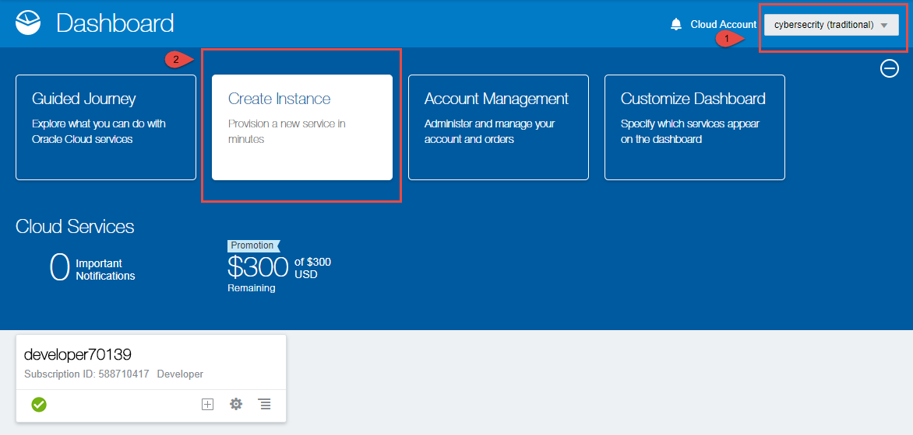
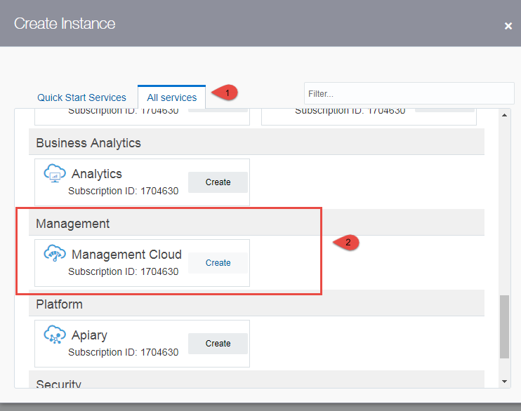

 

Update: January 11, 2018

# Introduction

The purpose of this lab guide is to walk customers through the steps necessary to request an Oracle Cloud Trial account as well as some of the services which will be required for lab exercises which follow.

***To log issues***, click here to go to the [github oracle](https://github.com/oracle/SecurityCloudDay/issues/new) repository issue submission form.

# Objectives

In this lab, we will cover –

- How to request an Oracle Cloud Trial account
- How to create your Oracle Management Cloud Instance
- How to add your AWS account to Oracle CASB Cloud Service

# Pre-requisites

- A valid email address
- Credit card to sign up for your Oracle Cloud Trial account
 - Trial accounts are free and are enabled with $300 credit
 - **Your card will not be automatically charged once the $300 credit has been consumed**

## Requesting your free Oracle Cloud Promotional Account ($300 credit)

Proceed as indicated below to request your free Oracle Cloud account. This account comes with $300 credit to try out any cloud service and will be used primarily for the use cases defined in the workshop. 

While your credit card is required to sign up, keep in mind that you won’t be charged unless you explicitly decide to extend the services after your $300 credit is fully used. 

Go to https://myservices.us.oraclecloud.com/mycloud/signup?language=en

- Fill in the form as shown below

	

- Provide your cell phone number and click “Request Code”

	

- Type in the code received on your mobile phone and click “Verify”

	

- Add Credit Card Details. You won’t be charged unless you choose to extend after your $300 credit is fully used.

	

- Accept the Terms & Conditions

	

 After about 15 minutes your account will be provisioned and you will receive a welcome email with details on the next steps

- Navigate to “My Services Administration” URL shown above to get started and login with the temporary password provided

	

- Set a new password for your account

	

## Creating your Oracle Management Cloud Instance

- Continuing from last step above, toggle selector to <ID Domain (Traditional)> and click “Create Instance”

	

- From the “All Services” tab, scroll down and select “Management Cloud”

	

- Fill in the details required and click “Create”

	

- After about 15 minutes your new “Management Cloud Service Instance” is created and confirmation sent to the admin email address with further details.

	

## Insert CASB stuff here

- Insert CASB stuff here
