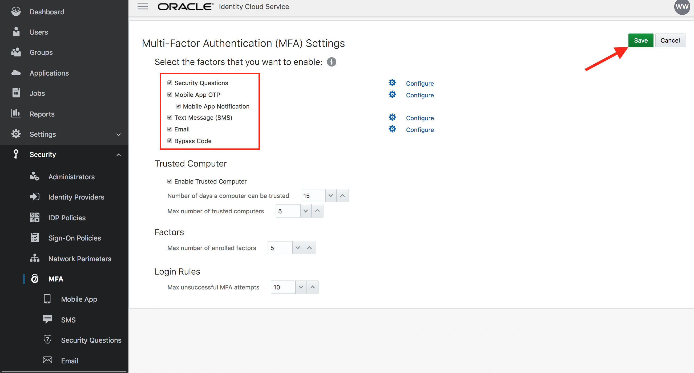
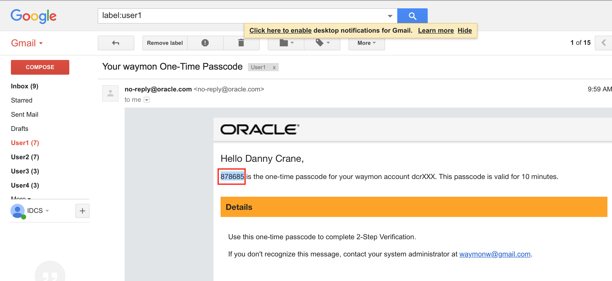
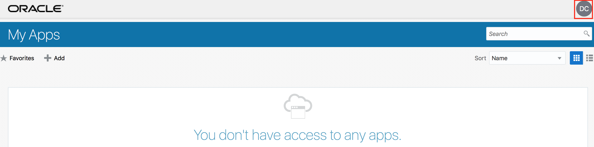
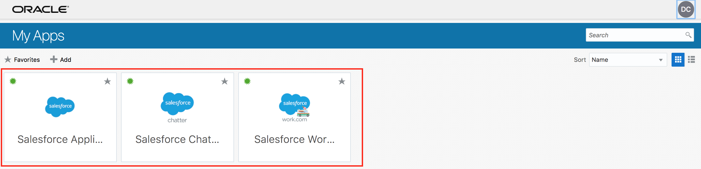

  
Update: October 31, 2017

## Introduction

This is the first of several labs that are part of the **Oracle Public Cloud Security and Management workshop.** This workshop will walk you through the various capabilities of `Oracle Identity Cloud Service`.

Although you will login as a single user, you will take on 3 Personas during the workshop. The **LOB Administrator** Persona will create users via CSV upload, setup and configure SSO Apps, configure MFA and create registration profiles for External users. The **End-User** persona will activate her account, setup and login using various MFA channels, request groups, verify SSO for apps from unified launchpad, login via Social provider, (For External User) self-register to IDCS. The **Developer** persona will configure a custom login page relevant to the Organization, protect an on-premise application using CloudGate, explore IDCS REST API's in interactive notebook-style, and create a custom application leveraging IDCS API's and authentication tools.

***To log issues***, click here to go to the [github oracle](https://github.com/oracle/SecurityCloudDay/issues/new) repository issue submission form.

## Objectives

- Upload Users `<--Persona: Administrator`
- Configure SSO Apps `<--Persona: Administrator`
- Assign Apps to Group `<--Persona: Administrator`
- Configure MFA `<--Persona: Administrator`
- Activate Account `<--Persona: End-User`
- Login and enroll in MFA `<--Persona: End-User`
- Request Group `<--Persona: End-User`
- Verify Apps SSO `<--Persona: End-User`
- Create Registration profile `<--Persona: Administrator`
- Self Registration `<--Persona: External End-User`
- API Tour `<--Persona: Developer`


## Required Artifacts
- The following lab requires an Oracle Public Cloud account trial subscription.
- Salesforce developer account

### **STEP 0.1**: Login to your Oracle Cloud Account
- From any browser, go to the URL:
    [https://cloud.oracle.com](https://cloud.oracle.com)

- click **Sign In** in the upper right hand corner of the browser

- Ensure **Cloud Account with Identity Cloud Service** is selected. Enter your Cloud Account Name. Click on **My Services**

- On the login page, enter your User Name and Password and click **Sign In** 

- You will be presented with a Dashboard displaying the various cloud services available to this account.

    

### **STEP 0.2**: Access IDCS Admin Console 

- From the Cloud My Services Dashboard, Click on **Users** in the upper right hand corner. Then click on **Identity Console** button located towards upper right hand corner again. 

	

- If you have logged in using your Administrator Account, the users are shown up in IDCS Admin Console. Other Admin Console sections are also available.

	

### **STEP 0.3**: Access IDCS MyApps Console

- From the drop-down associated with the displayed logged-in user in the upper right hand corner of IDCS Admin Console, choose "My Apps"

	
	
	
	
### **STEP 0.4**: Access Oracle Cloud Services

- Click on **Dashboard** to come back to My Services page again. Display the sidebar by clicking on the bar in the upper left hand corner. then click on **Services** to display available Oracle Cloud Services.

	
	
	
	
- Click on the Service **Analytics**. Observe that the logged in user has successfully single signed-on to the Analytics service console

	

# Scenario - Standard Employee Workflow

## Onboard Users - (Persona: Administrator)

IDCS supports User (also Groups) on-boarding from on-premise Active Directory, File Upload, REST API, on-premise Oracle Identity Management solution, or manually from IDCS Admin console. For the workshop we will be using File Upload option for Users and use IDCS Admin console to manually create Group(s).

### **STEP 1**: Obtain Upload CSV file

- Obtain the CSV file **Users.csv** provided as part of supporting resources for the Lab. Inspect the content of the file opening it in your favorite editor.
	
	
	
- Make sure that your target End User with proper ***Email Address*** is present on the file. If not there, make necessary changes.


### **STEP 2**: Import File in IDCS

- Go to IDCS Admin console using your Administrator Account credentials as described [here](#adminconsole). Ensure that you are on the **Users** tab

- Click on the **Import** button. 

	
	
- Select the **CSV** file. Click on **Import**

    

- Go to the **Jobs** tab in Admin Console. Verify that the Import Job finished successfully. Click on **View

    
    
- Click on **View Details** button. This will show the detailed information on the ***Import** job. Inspect the details.

     

### **STEP 3**: Verify User Creation

- Go to the **Users** tab in Admin Console. Verify that the new users are visible on the console.

    

- Click on your target End-User and verify User's detailed attribute information

    
    
## Configure SSO Apps - (Persona: Administrator)

- Download IDCS Metadata to a local XML file 

	

- Login to salesforce.com tenant with Administrator credentials

- Go to Single Sign-On settings under  Security Controls menu

- Enable Federated Single Sign-On 

	

- Import IDCS Metadata - Use New from Metadata File option
 
- Save the configuration 

	

    

    

    

     Change

     Change

- Note the Organization ID value 

	  Change

- Note the Tenant Domain Name value 

	 Change

- Go to IDCS Admin console -> Applications tab

- Click on Add button and select App Catalog 

	

- Search for Salesforce App and Add 

	
	
	


- On the first page of Configuration screen provide the previously noted Organization ID and Domain Name values

- Click on Next 

	

- Click on Finish button  

	

- Activate the application 

	

## Assign Apps to Group - (Persona: Administrator)

- Go to IDCS Admin Console -> Groups tab 

	

- Add group `Employee`. Check the box `User can request access`. 

	

- Click on `Finish` 

	

- Go to the `Access` tab. Click on `Assign`. 

- Select `Salesforce` and confirm 

	
	
	


## Configure MFA - (Persona: Administrator)

- Go to IDCS Admin Console -> Security tab. Select `MFA` from the Sidebar to the left.

- Select `All Users` for the label **Select the users that you want to enable MFA for:**

- Select all the options for **Select the factors that you want to enable:**

	

- Keep all other parameters to their Default values. Click on `Save` 

	
	

## Activate Account - (Persona: End-User) 

- Access the activation email from Email Account. Click on the activation link.

	

- Change password and click on `Submit`

	
	
	
  
## Enroll in MFA - (Persona: End-User)

- On the **Enable 2-Step Verification** page, click on `Enable`

	

- Select the method `Mobile Number`

	

- Provide your mobile number and click on `Send`

	
	
- Access the text message on your mobile and note the 6-digit One-time code on the message.
	
	

- Provide the 6-git code on the enrollment page and click on `Verify`

	
	
- Ensure that the success enrollment message is displayed. Click on `Done`
	
	
   

- Logout from IDCS and re-login with your credentials

- Ensure that you are challenged by 2-Factor authentication and have received text message on your mobile phone containing a new 6-digit one time code.

- Provide the new 6-digit code on the challenge screen for verification

- On successful verification, ensure that user is logged in to the **MyApps** page of IDCS

	

## Request Group - (Persona: End-User)

- From MyApps page click on `Add` access request button.

	

- From the **Groups** tab, select `Employee` group

	
	
- Click on `+` sign to request access to the group. Provide justification on the resulting popup page. Click on `OK`

	
	
	
	
- Go to `My Profile` section from menu located top-right

	
	
- Ensure that `Employee` group is visible under **My Access** sub-tab
	
	
	
- Go to `My Apps` section from menu located top-right

	
	
- Ensure that Salesforce applications are visible now on the **MyApps** page
	
	


## Verify Apps SSO - (Persona: End-User)

- Click on the `Salesforce Chatter` app. 
- Ensure that user is automatically logged-in to Salesforce Chatter (**SSO**)

	

# Scenario - External User Workflow

## Create External Group

- Go to IDCS Admin Console -> Groups tab 

- Add group `OurPartner`

	

- Click on `Finish`

	 


## Create Registration profile  - (Persona: Administrator)

- Login to IDCS Admin Console as an Administrator. Go to the **Settings** tab and click on the **Self Registration** menu from the sidebar.

	

- Click on **Add Profile**

- On the Profile creation page, enter `Profile Name -` **`OurPartner`**. 

	

- Click on **Add** under `Assign to Group` section. Select the external group **`OurPartner`** and click on **OK**

	

- Under `Self-Registration Content` section, enter `Registration Page Name -` **`OurPartner`**.

	

- Review the remaining sections. Keep the default values.

	

- Click on **Save** and then click **Yes** on the **Confirmation**.

	
	
	

- Click on **Activate** and then **Activate Profile**

	
	
	

- Note the **`Profile ID`** and create the self-registration link in the following format :

	```js
	https://<tenant>.identity.oraclecloud.com/ui/v1/signup?profileid=<Noted Profile ID>
	```
	<blockquote>
	This link can be forwarded in the registration invitation email or other channel to the external users.
	</blockquote>
	
	

## Self Registration - (Persona: End-User)

- Click on the Registration link supplied.

	

- Enter required profile information and **submit**

	

- On the Success message page, click on **continue**. **Skip** the 2-step verification.

	
	
	

- From the `My Apps` page access the `My Profile` menu. 

	
	
	

- Go to the `My Access` tab. Ensure that user is part of the group configured in the registration profile. 

	<blockquote>
	If the group is assigned to one or more apps in IDCS, the new user will automatically gain access to those apps, and the apps will be visible on the My Apps page.
	</blockquote>
	
	

# Scenario - Developer Features

## API Tour - (Persona: Developer)

IDCS is built using API-first approach. All the features are accessible through REST API's and are protected by OAuth 2.0 framework. Most of the API's need an **OAuth Access Token** in order to be accepted by IDCS. 

In this exercise you will explore some of the API's in the reportaire, especially - 

	1. IDCS Configuration Discovery
	2. Obtaining and inspecting OAuth token
	3. User management
	4. Audit API

The exercise will use hosted **Jupyter Notebook**

[Access Notebook Here](http://140.86.32.135:65000/notebooks/IDCS-API.ipynb)

**Note:** Replace **`port`** `65000` on the URL with the port provided and refresh browser.
