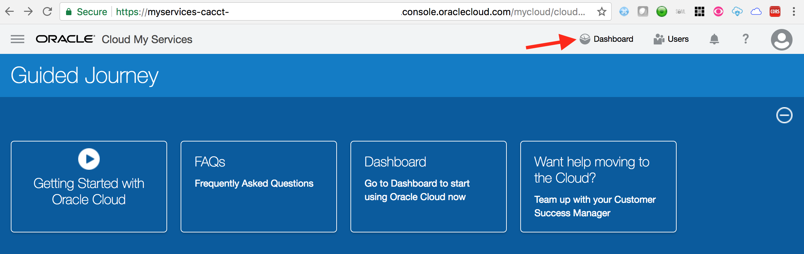
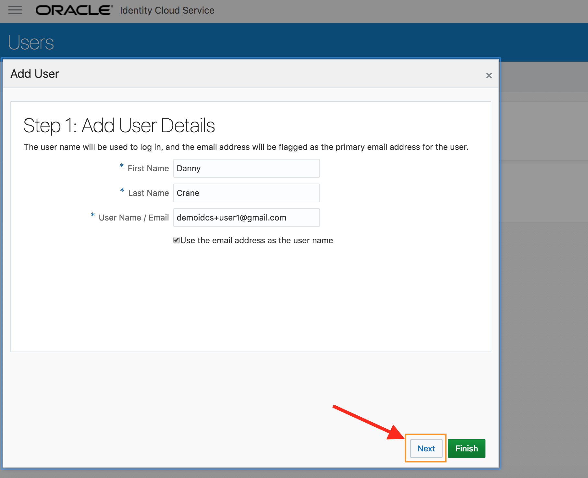
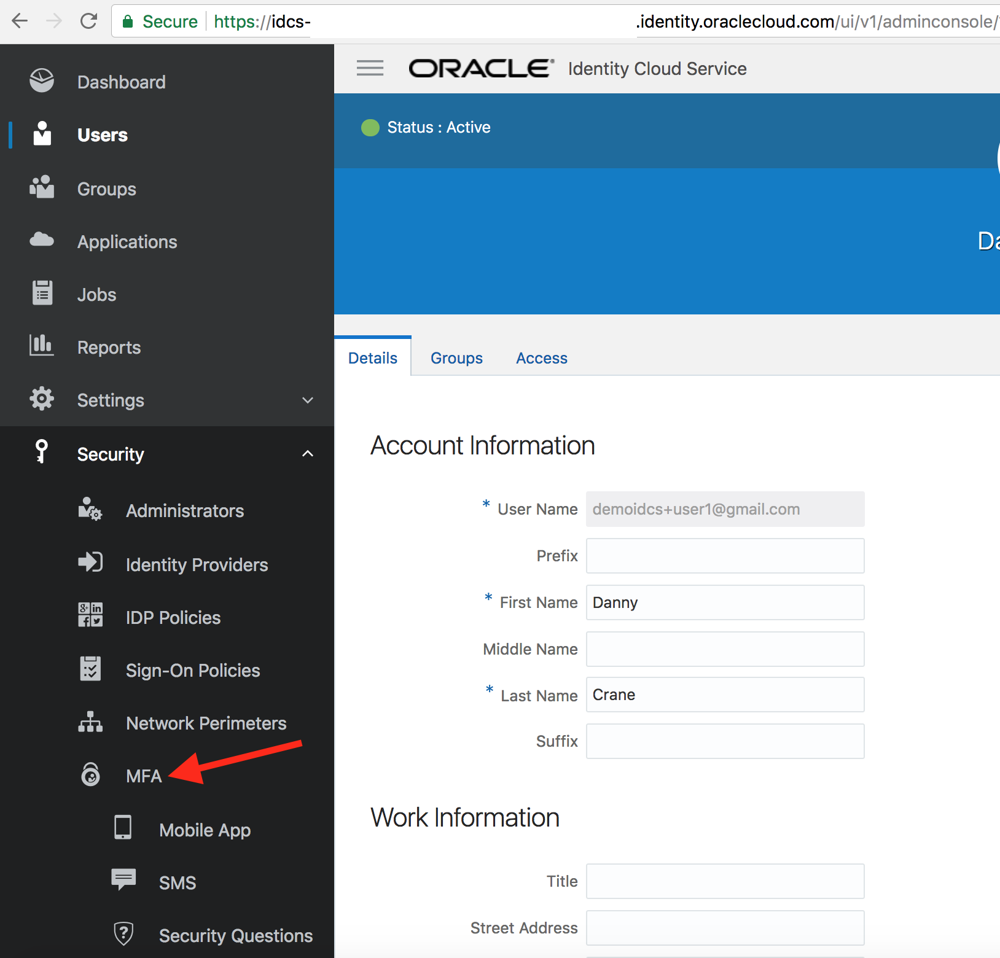
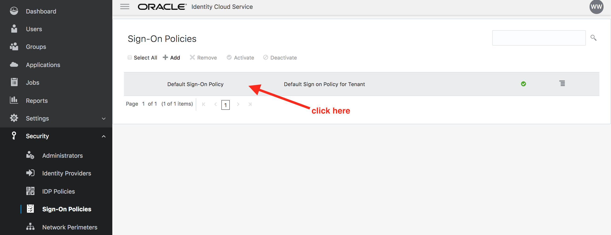
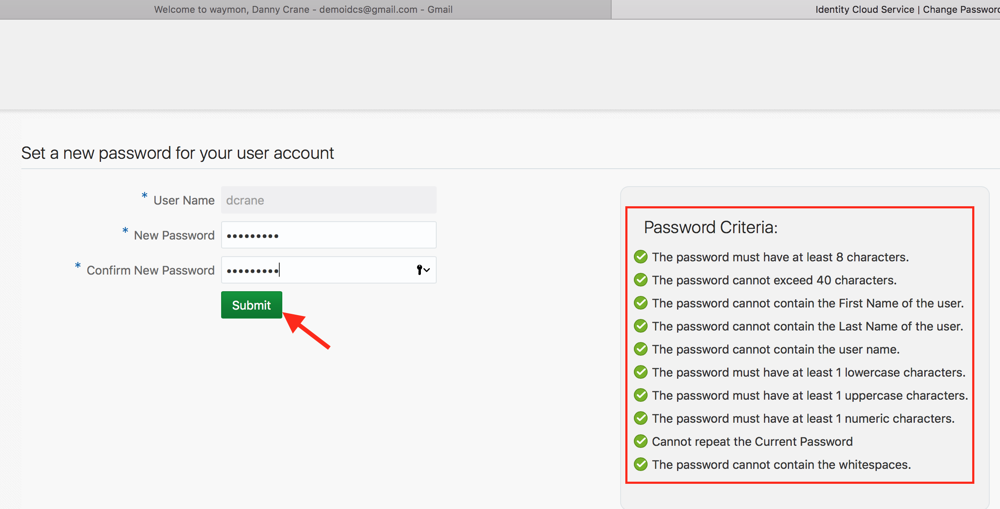
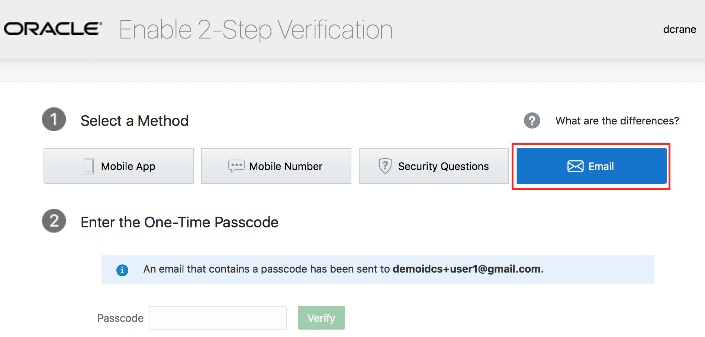
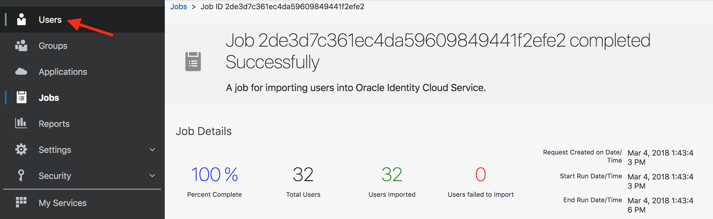
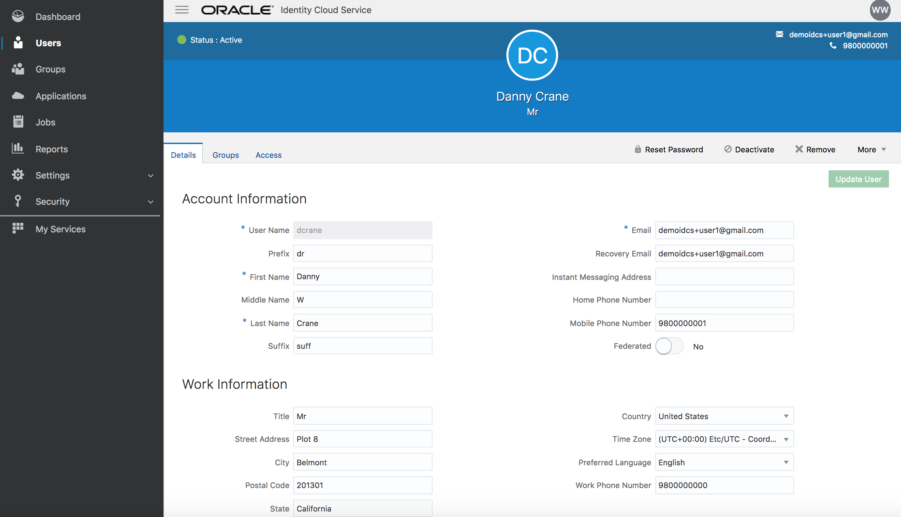
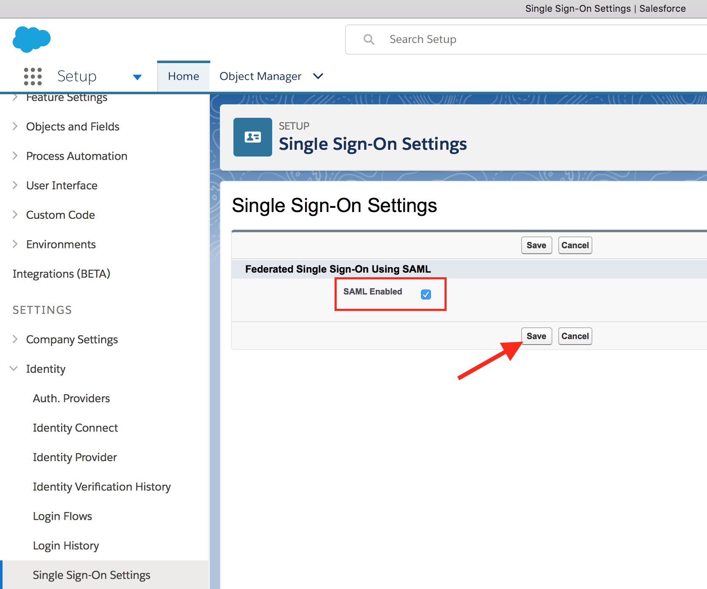
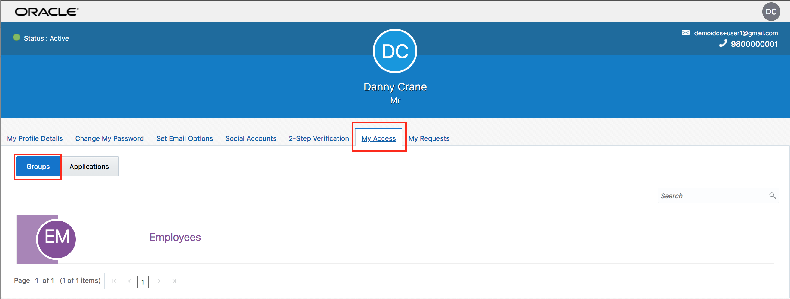

  
Update: March 5, 2018

## Introduction

This is the first of several labs that are part of the **Oracle Public Cloud Security and Management workshop.** 

First it will walk you through the steps necessary to request an Oracle Cloud Trial account as well as some of the services which will be required for lab exercises which follow. 

Then it will walk you through the various capabilities of **Oracle Identity Cloud Service**.


## Objectives

### Oracle Cloud - Navigate

- How to request an Oracle Cloud Trial account
- Arrange services on the cloud dashboard for easy navigation

### IDCS - overview

- Create user `<--Persona: Administrator`
- Configure multi-factor authentication `<--Persona: Administrator`
- Activate account `<--Persona: End-User`
- Enroll in multi-factor authentication `<--Persona: End-User`
- Built-in integration with Oracle cloud services `<--Persona: End-User`


### (Optional) IDCS - advanced

- Onboard users `<--Persona: Administrator`
- Configure SSO for an app `<--Persona: Administrator`
- Grant app to group `<--Persona: Administrator`
- Request group `<--Persona: End-User`
- Verify SSO `<--Persona: End-User`


## Pre-requisites

- [x]  A valid email address
- [x]  Credit card to sign up for your Oracle Cloud Trial account
   -  Trial accounts are free and are enabled with $300 credit
   -  **`Your card will not be automatically charged once the $300 credit has been consumed`**

## Request your free Promotional Account ($300 credit)

Proceed as indicated below to request your free Oracle Cloud account. This account comes with $300 credit to try out any cloud service and will be used primarily for the use cases defined in the workshop. 

While your credit card is required to sign up, keep in mind that you won’t be charged unless you explicitly decide to extend the services after your $300 credit is fully used. 

Go to [https://cloud.oracle.com/tryit](https://cloud.oracle.com/tryit)

- Click on **Create a Free Account**

	

- Fill in the form as shown below

	

- Provide your cell phone number and click **`Request Code`**

	

- Type in the code received on your mobile phone and click **`Verify`**

	

- Add Credit Card Details. You won’t be charged unless you choose to extend after your $300 credit is fully used.

	

- Accept the **`Terms & Conditions`**

	

After about 15 minutes your account will be provisioned and you will receive a welcome email with details on the next steps


- Navigate to **`My Services Administration`** URL shown above to get started and login with the temporary password provided

	

- Set a new password for your account

	
	

## Login to your Oracle Cloud Account

- From any browser, go to the URL:
    [https://cloud.oracle.com](https://cloud.oracle.com)

- click **Sign In** in the upper right hand corner of the browser


- Ensure **Cloud Account with Identity Cloud Service** is selected. Enter your cloud account name. Click on **My Services**


- On the login page, enter your user name and password and click **Sign In** 


- You will be redirected to the landing page dashboard.


## Arrange services on dashboard

- If not already there, click on the **`Dashboard`** link on the top right hand corner.



- Verify that dashboard shows the **`Identity Cloud`** service tile.


- Click on **`Customize Dashboard`**


- Scroll down on the pop-up page to find the service **`Oracle CASB`**. Click on  **`Show`** button against the service. Close the pop-up.


- Verify that a service tile appears for **`Oracle CASB`** on the dashboard.


------------------------------------------------------
# IDCS - overview
------------------------------------------------------

## Access IDCS Admin Console - (Persona: Administrator)

- From the cloud **My Services** dashboard, click on **Users** in the upper right hand corner. 


- Then click on **Identity Console** button located towards upper right hand corner again. 


- The users are shown up in IDCS admin console. 


	

## Create User - (Persona: Administrator)

<blockquote>
	<font color="blue">
		<p>
			IDCS supports user (also groups) on-boarding from on-premise 			<b>Active Directory</b>, using file upload, REST API, on-premise 			<b>Oracle Identity Management</b> solution, or manually from IDCS 			admin console.
		</p>
	</font>
</blockquote>

For the exercise we will be manually creating a user from admin console.

- On the **Users** page, click on the **Add** button. 


- On the pop-up page (step 1), provide values for **First Name**, **Last Name** and valid **E-mail**. Click on **Next**.



- On step 2, select the group **OCI_Administrators**. Then click on **Finish**.
> This group grants access to Oracle' **IAAS** service (Infrastructure-As-A-Service). 
	


- Verify that the user gets created successfully.


- Congratulations, you successfully created a new user into IDCS and granted him access to Oracle IAAS.


## Configure multi-factor authentication - (Persona: Administrator)

<blockquote>
	<font color="blue">
		<p>
			When a user signs in to an application, they are prompted for their 			user name and password, which is the first factor – something that 			they know. With <b>Multi Factor Authentication (MFA)</b> enabled in 			Oracle Identity Cloud Service, the user is then required to provide 			a second type of verification. This is called <b>2-Step 			Verification</b>.
		</p>
		<p>
			The two factors work together to add an additional layer of security 			by using either additional information or a second device to verify 			the user’s identity and complete the login process.
		</p>
	</font>
</blockquote>


- From IDCS admin console, select **Security** -> **MFA** from the sidebar to the left.

  

- Select all the options for **Select the factors that you want to enable**. Keep all other parameters to their default values. Click on **Save**.

  

- Confirm new MFA settings.


	
- Select **Security** -> **Sign-On Policies** from the sidebar to the left of admin console.


- Click on **Default Sign-On Policy**. This will open up the policy. 



- Go to the **Sign-On Rules** tab and then click on **Edit** against the **Default Sign-On Rule**.


- Check the box **Prompt for an additional factor**. Set the value of **Enrollment** to `Optional`. Click on **Save**.


- Congratulations, you enabled and configured multi-factor authentication within IDCS.


## Activate account - (Persona: End-User) 

<blockquote>
	<font color="green">
		<p>For end-user flow, use either a separate browser or an incognito/		private browser session. This will ensure that administrator and user 		sessions are not mixed up.</p>
	</font>
</blockquote>

- Open your email client for the address you provided during user creation. Verify that there is an activation email from IDCS.


- Open and review the email. Click on the **Activate Your Account** button. 


	
- IDCS change password page will open up. Provide a suitable password that passes the listed **Password Criteria**. The criterion/rule verification is indicated with a green check mark against each of the rule. Click on **Submit**.



- Verify that you are redirected to the MFA enrollment page.


  
## Enroll in multi-factor authentication - (Persona: End-User)

- On the **Enable 2-Step Verification** page, click on **Enable**.


- Select the method **Email**.


	
- Access your email to obtain the one-time passcode .
	


- Provide the 6-digit code on the enrollment page and click on **Verify**.


	
- Ensure that the success enrollment message is displayed. Click on **Done**.
	


- Verify that you are redirected to the empty **My Apps** page.


- Sign out from IDCS and re-login with your credentials.


- Ensure that you are challenged by 2-Factor authentication and have received a new email containing a new 6-digit one time code.


- Provide the new 6-digit code on the challenge screen for verification.


- On successful verification, ensure that you are logged in to the **My Apps** page.


## Integration with Oracle Cloud Services

- From the drop-down associated with the displayed logged-in user in the upper right hand corner of IDCS My Apps page, choose **My Home** to come back to the cloud home page.


- Display the sidebar by clicking on the hamburger menu in the upper left hand corner. Then expand **Services** to display available Oracle cloud services.

	
	
- Click on the service **Compute** which is Oracle's **IAAS** serice (Infrastructure-As-A-Service)


- Observe that the logged in user has successfully single signed-on to Oracle's **IAAS** service console.


- Explore various tabs on the IAAS service console.

- Congratulations, you completed the IDCS overview hands-on lab.

------------------------------------------------------
# (Optional) IDCS - advanced
------------------------------------------------------


## Onboard Users - (Persona: Administrator)

<blockquote>
	<font color="blue">
		<p>
			IDCS supports user (also groups) on-boarding from on-premise 			<b>Active Directory</b>, using file upload, REST API, on-premise 			<b>Oracle Identity Management</b> solution, or manually from IDCS 			admin console.
		</p>
	</font>
</blockquote>

For the exercise we will be using `file upload` option for users.

### **STEP 0**: Obtain upload CSV file

- Download the CSV file for users from [here](resources/Users.csv). Right-click on the link and save the file in your system. Inspect the content of the file from your favorite editor.

### **STEP 1**: Navigate to IDCS User Management

- From any browser, go to the URL:
    [https://cloud.oracle.com](https://cloud.oracle.com)

- click **Sign In** in the upper right hand corner of the browser


- Ensure **Cloud Account with Identity Cloud Service** is selected. Enter your cloud account name. Click on **My Services**


- On the login page, enter your user name and password and click **Sign In** 


- You will be redirected to the landing page dashboard.


- From the cloud **My Services** dashboard, click on **Users** in the upper right hand corner. 


- Then click on **Identity Console** button located towards upper right hand corner again. 


- The user management interface is shown up in IDCS admin console. 


### **STEP 2**: Import users in IDCS


- On the **Users** page, click on the **Import** button. 


	
- Select the **CSV** file that you saved locally. Click on **Import**


- Go to the **Jobs** tab in admin console. Verify that the import Job finished successfully. Click on **View Details** button.


    
- This will show the detailed information on the **Import** job. Inspect the details.


- Congratulations, you successfully imported users into IDCS.

### **STEP 3**: Verify user creation

- Go to the **Users** menu in admin console. Verify that the new users are visible on the console.




- Click on your target end-user and verify user's detailed attribute information.

	<blockquote>
		<font color="red">
			User assignments will be provided during the session.
		</font>
	</blockquote>




    
## Configure SSO for an app - (Persona: Administrator)

<blockquote>
	<font color="blue">
		<p>
			Oracle Identity Cloud Service(IDCS) provides integration with any 			service that can be integrated via <b>SAML</b> (Security Access 			Markup Language) protocol. Administrations will be able to manage 			users into various applications via single control panel and end 			users will be able to get to applications via single click.
		</p>
		<p>
			IDCS provides support for standard SAML 2.0 browser POST login & 			logout profiles.
		</p>
	</font>
</blockquote>


In this hands-on exercise, we will setup integration with **Salesforce** using SAML. IDCS will act as **IdP** (Identity Provider) and Salesforce org as **SP** (Service Provider also known as a Relying Party)

- Download and save IDCS Metadata to a local XML file for your instance. Metadata is available from the following location- 
<blockquote>
	<font color="red">
		https://idcs-xxxxxx.identity.oraclecloud.com/fed/v1/metadata
	</font>
	<font color="blue">
		<br>where idcs-xxxxxx is your IDCS tenant name that you can grab from the browser URL of your IDCS console. Copy-paste the constructed URL on a new browser tab and save the XML file locally.
	</font>
</blockquote>


<blockquote>
		<font color="red">
			Following activities on Salesforce is optional. Email the metadata XML to your proctor.
		</font>
</blockquote>
	
- Login to the **Salesforce** developer [account](https://demoidaas-dev-ed.my.salesforce.com)

	<blockquote>
		<font color="red">
			Credentials will be provided during session.
		</font>
	</blockquote>
	
- Bring up the **setup** page.


- From side menu bar, go to **Settings** -> **Identity** -> **Single Sign-On Settings**


- Click on **Edit** and enable **Federated Single Sign-On Using SAML** option. Click on **Save**.



- Click on **New from Metadata File** button to import IDCS metadata. Select the downloaded metadata XML file using **Choose File** button. Click on **Create**.


- Keep all the default information and click on **Save**


	
- Go to IDCS admin console -> **Applications** menu


- On the **Applications** page, click on **Add** and select **App Catalog** on the pop-up.


- Search for **Salesforce** app and click on **Add**


	


- On the first page of configuration screen enter the **Organization ID** and **Domain Name** values as provided below. Then click on **Next**.

	<blockquote>
		<font color="red">
			These values are exactly same as those found in the IDCS settings in Salesforce you just configured.
		</font>
	</blockquote>

```	
Domain Name : demoidaas-dev-ed
Organization ID : 00D1N000002M18V
```


- Click on **Finish** button 


- **Activate** the application 


Congratulations, you successfully added and activated an application in IDCS.

## Grant app to group - (Persona: Administrator)

- Go to IDCS admin console -> **Groups** menu 


- Add group **Employees**. Check the box `User can request access`. Click on **Finish** 


	

	


- Go to the **Access** tab. Click on **Assign**. 


- Select **Salesforce** and confirm 


	


- Congratulations, you successfully created a group and assigned an application to it.


## Request group - (Persona: End-User)

- From MyApps page click on **Add** access request button.


- Verify that **Employees** group is available on the **Groups** tab. Click on `+` sign to request access to the group.


	
- Provide justification on the resulting popup page. Click on **OK**.


		
- Go to **My Profile** section from menu located top-right.


	
- Ensure that **Employee** group is visible under **My Access** tab.
	

	
- Go to **My Apps** section from menu located top-right.


	
- Ensure that Salesforce applications are visible now on the **My Apps** page.
	


## Verify SSO - (Persona: End-User)

- Click on the **Salesforce Chatter** app. 


- Ensure that user is automatically logged-in to Salesforce Chatter (**SSO**)


- Congratulations, you completed the IDCS advanced hands-on lab.

