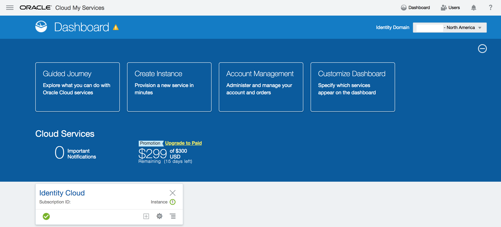
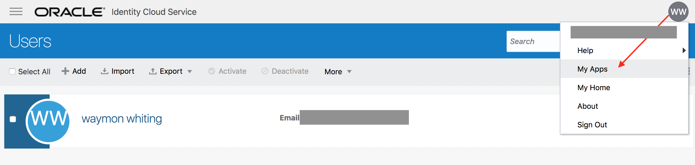
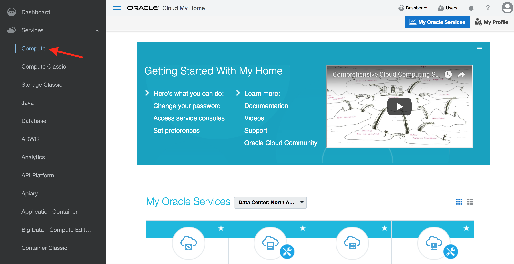
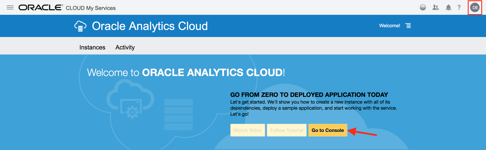
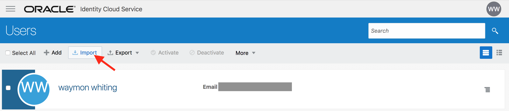
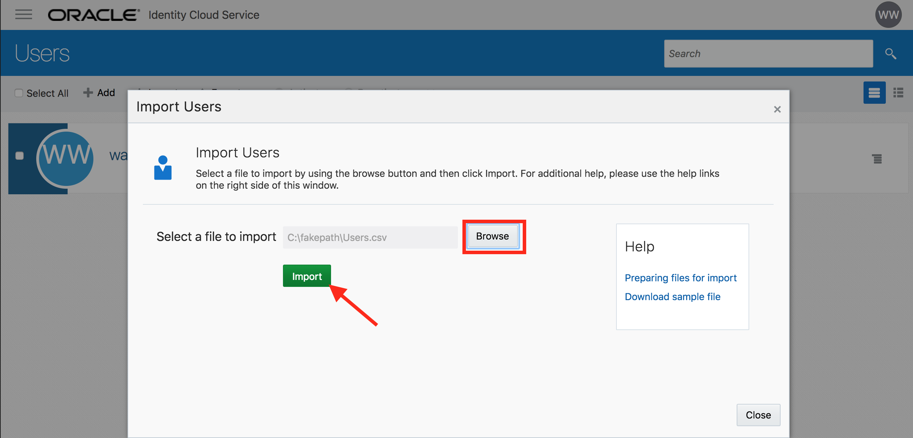
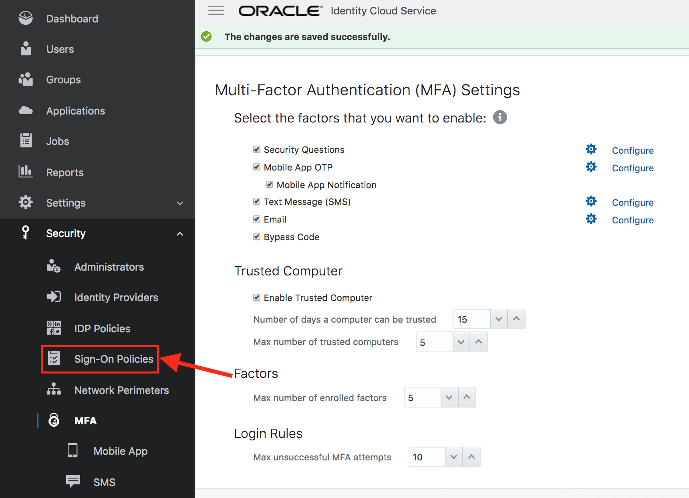
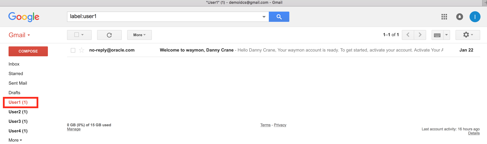
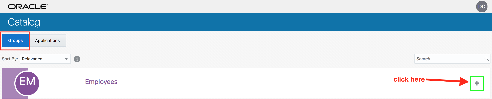
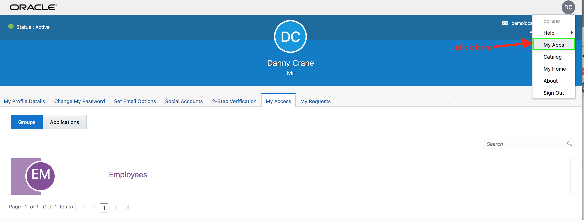

  
Update: March 5, 2018

## Introduction

This is the first of several labs that are part of the **Oracle Public Cloud Security and Management workshop.** This workshop will walk you through the various capabilities of **Oracle Identity Cloud Service**.

Although you will login as a single user, you will take on 2 Personas during the workshop. 

* The **LOB Administrator** Persona will 

		Onboard users via CSV upload
		Setup and configure SSO Apps
		Configure external identity provider
		Configure MFA and policies
		
* The **End-User** persona will 

		Activate her account 
		Setup and login using various MFA channels 
		Request groups
		Verify SSO for apps from unified launchpad 

### Optional	

* We will see a **Developer** persona exploring `IDCS REST API's` in interactive notebook-style.


## Objectives

- In-built integration with Oracle cloud services `<--Persona: Administrator`
- Onboard Users `<--Persona: Administrator`
- Configure SSO Apps `<--Persona: Administrator`
- Assign Apps to Group `<--Persona: Administrator`
- Configure multi-factor authentication `<--Persona: Administrator`
- Activate Account `<--Persona: End-User`
- Enroll in multi-factor authentication `<--Persona: End-User`
- Request Group `<--Persona: End-User`
- Verify Apps SSO `<--Persona: End-User`
- Optional: API Tour `<--Persona: Developer`


## Pre-requisites

- The following lab requires an **Oracle Public Cloud** account trial subscription.

### **STEP 0.1**: Login to your Oracle Cloud Account

- From any browser, go to the URL:
    [https://cloud.oracle.com](https://cloud.oracle.com)

- click **Sign In** in the upper right hand corner of the browser


- Ensure **Cloud Account with Identity Cloud Service** is selected. Enter your cloud account name. Click on **My Services**


- On the login page, enter your user name and password and click **Sign In** 


- You will be presented with a dashboard displaying the various cloud services available to this account.



### **STEP 0.2**: Access IDCS Admin Console 

- From the cloud **My Services** dashboard, click on **Users** in the upper right hand corner. 


- Then click on **Identity Console** button located towards upper right hand corner again. 


- If you have logged in using your administrator Account, the users are shown up in IDCS admin console. 


### **STEP 0.3**: Access IDCS MyApps Console

- From the drop-down associated with the displayed logged-in user in the upper right hand corner of IDCS admin console, choose **My Apps**


	

	
# Scenario: Integration with Oracle cloud services

- From the drop-down associated with the displayed logged-in user in the upper right hand corner of IDCS admin console, choose **My Services** to come back to the cloud dashboard.


- Display the sidebar by clicking on the hamburger menu in the upper left hand corner. then expand **Services** to display available Oracle cloud services.

	
	
- Click on the service **Analytics**. 



- On the **Analytics** console, click on **Go to Console**



- Observe that the logged in user has successfully single signed-on to the **Analytics** service console


# Scenario - Standard Employee Workflow

## Onboard Users - (Persona: Administrator)

<blockquote>
	<font color="blue">
		<p>
			IDCS supports user (also groups) on-boarding from on-premise 			<b>Active Directory</b>, using file upload, REST API, on-premise 			<b>Oracle Identity Management</b> solution, or manually from IDCS 			admin console.
		</p>
	</font>
</blockquote>

For the exercise we will be using `file upload` option for users.

### **STEP 1**: Obtain upload CSV file

- Download the CSV file for [Users](resources/Users.csv). Inspect the content of the file from your favorite editor.
	

### **STEP 2**: Import users in IDCS

- Go to IDCS Admin console using your administrator account credentials. Ensure that you are on the **Users** tab

- Click on the **Import** button. 

	
	
- Select the **CSV** file. Click on **Import**

    

- Go to the **Jobs** tab in admin console. Verify that the import Job finished successfully.

    
    
- Click on **View Details** button. This will show the detailed information on the **Import** job. Inspect the details.

    

### **STEP 3**: Verify user creation

- Go to the **Users** tab in admin console. Verify that the new users are visible on the console.

    

- Click on your target end-user and verify user's detailed attribute information.

    
    
## Configure SSO Apps - (Persona: Administrator)


<blockquote>
	<font color="blue">
		<p>
			Oracle Identity Cloud Service(IDCS) provides integration with any 			service that can be integrated via <b>SAML</b> (Security Access 			Markup Language) protocol. Administrations will be able to manage 			users into various applications via single control panel and end 			users will be able to get to applications via single click.
		</p>
		<p>
			IDCS provides support for standard SAML 2.0 browser POST login & 			logout profiles.
		</p>
	</font>
</blockquote>


In this hands-on exercise, we will setup integration with **Salesforce** using SAML. IDCS will act as **IdP** (Identity Provider) and Salesforce org as **SP** (Service Provider also known as a Relying Party)

- Download and save IDCS Metadata to a local XML file for your instance. Metadata is available from the following location - 
<blockquote>
	<font color="blue">
		https://idcs-xxxxxx.identity.oraclecloud.com/fed/v1/metadata
	</font>
</blockquote>


	
- Login to the **Salesforce** developer [account](https://demoidaas-dev-ed.my.salesforce.com)

<blockquote>
	<font color="red">
		Credentials will be provided during session.
	</font>
</blockquote>

- From side menu bar, go to **Settings** -> **Identity** -> **Single Sign-On Settings**


- Click on **Edit** and enable **Federated Single Sign-On Using SAML** option


- Click on **New from Metadata File** button to import IDCS metadata. Select the downloaded metadata file using **Choose File** button. Click on **Create**.


- Keep all the default information and click on **Save**


- Note the **Organization ID** value.


- Note the org **Domain Name** value. 


	
- Go to IDCS admin console -> **Applications** tab

- Click on **Add button** and select **App Catalog**


- Search for **Salesforce** app and click on **Add**


	


- On the first page of configuration screen provide the **Organization ID** and **Domain Name** values -

```	
Domain Name : demoidaas-dev-ed
Organization ID : 00D1N000002M18V
```


- Click on **Next** 


- Click on **Finish** button  

- **Activate** the application 


## Assign Apps to Group - (Persona: Administrator)

- Go to IDCS admin console -> **Groups** menu 

	

- Add group **Employee**. Check the box `User can request access`. 

	

- Click on **Finish** 

	

- Go to the **Access** tab. Click on **Assign**. 

- Select **Salesforce** and confirm 

	
	
	


## Configure MFA - (Persona: Administrator)

When a user signs in to an application, they are prompted for their user name and password, which is the first factor – something that they know. With **Multi Factor Authentication (MFA)** enabled in Oracle Identity Cloud Service, the user is then required to provide a second type of verification. This is called **2-Step Verification**.

The two factors work together to add an additional layer of security by using either additional information or a second device to verify the user’s identity and complete the login process.


- Go to IDCS admin console. Select **Security** -> **MFA** from the sidebar to the left.


- Select all the options for **Select the factors that you want to enable:**


- Keep all other parameters to their default values. Click on **Save** 


	
- Select **Security** -> **Sign-On Policies** from the sidebar to the left of admin console.


- Click on **Default Sign-On Policy**. This will open up the policy. Go to the **Sign-On Rules** tab and click on **Edit** aganist **Default Sign-On Rule**.


- Check the box **Prompt for an additional factor**. Set the value of **Enrollment** to `Optional`


- Click on **Save**
	

## Activate Account - (Persona: End-User) 

- Login to gmail as [demoidcs@gmail.com](). Go to the label corresponding to the user. Verify that there is an activation email from IDCS.



- Open and review the email. Click on the **Activate Your Account** button. 


	

- IDCS change password page will open up. Provide a suitable password that matches the listed **Password Criteria**. Click on **Submit**.


- Verify that you are redirected to the MFA enrollment page.
  
## Enroll in MFA - (Persona: End-User)

- On the **Enable 2-Step Verification** page, click on `Enable`


- Select the method `Email`


	
- Access your email to obtain the one-time passcode .
	


- Provide the 6-digit code on the enrollment page and click on `Verify`


	
- Ensure that the success enrollment message is displayed. Click on `Done`
	


- Logout from IDCS and re-login with your credentials

- Ensure that you are challenged by 2-Factor authentication and have received a new email containing a new 6-digit one time code.

- Provide the new 6-digit code on the challenge screen for verification

- On successful verification, ensure that user is logged in to the **MyApps** page of IDCS.


## Request Group - (Persona: End-User)

- From MyApps page click on `Add` access request button.


- From the **Groups** tab, select `Employee` group


	
- Click on `+` sign to request access to the group. Provide justification on the resulting popup page. Click on `OK`


		
- Go to `My Profile` section from menu located top-right


	
- Ensure that `Employee` group is visible under **My Access** sub-tab
	

	
- Go to `My Apps` section from menu located top-right


	
- Ensure that Salesforce applications are visible now on the **MyApps** page
	


## Verify Apps SSO - (Persona: End-User)

- Click on the `Salesforce Chatter` app. 
- Ensure that user is automatically logged-in to Salesforce Chatter (**SSO**)


# Scenario - External User Workflow

## Create External Group - (Persona: Administrator)

- Go to IDCS admin console -> **Groups** 

- Add group **OurPartner**


- Click on **Finish**

 


# Scenario - Developer Features

## For Information Only: API Tour - (Persona: Developer)

IDCS is built using API-first approach. All the features are accessible through REST API's and are protected by OAuth 2.0 framework. Most of the API's need an **OAuth Access Token** in order to be accepted by IDCS. 

In this demo we will explore some of the API's in the reportaire, especially - 

	1. IDCS Configuration Discovery
	2. Obtaining and inspecting OAuth token
	3. User management
	4. Audit API

The demo uses hosted **Jupyter Notebook**

[Access Notebook Here](http://140.86.32.135:65000/notebooks/IDCS-API.ipynb)


