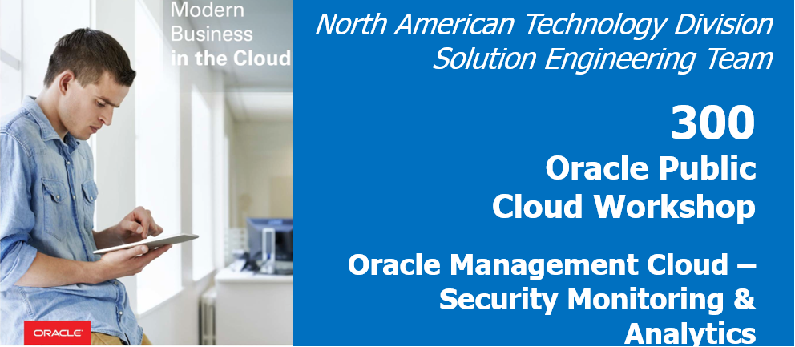  

Update: January 04, 2018

## Introduction

The purpose of this lab is to give the participant hands on experience of Security Monitoring and Analytics Cloud Service and how they can leverage this service to enable rapid detection and investigation of security threats.

***To log issues***, click here to go to the [github oracle](https://github.com/oracle/SecurityCloudDay/issues/new) repository issue submission form.

### Objectives

In this lab, we will cover –

   - How to access your SMA environment
   - Enabling SMA service
   - Reviewing pre-configured correlation rules
   - Creating alert rules
   - Uploading sample data
   - How to evaluate threats

### Pre-requisites

The following are minimum requirements for this lab
   - Oracle Cloud Trial account with OMC instance provisioned. Refer to [How to request your free trial account](https://csdoracle.github.io/Cloud-Security-Day/CSD-SETUP.html) if you haven't already done so.
   - Linux host with CURL available: One will be provided for the purposes of today's lab
   - Sample data: Staged on the linux host provided
   - A client machine with an internet connection and an SSH client

## STEP 1 - Accessing your Environment & Initial Configuration

### Accessing your OMC Instance

1. Navigate to one of the URLs in your Service Activation email to access the service. You will be prompted to change the password on first login.

	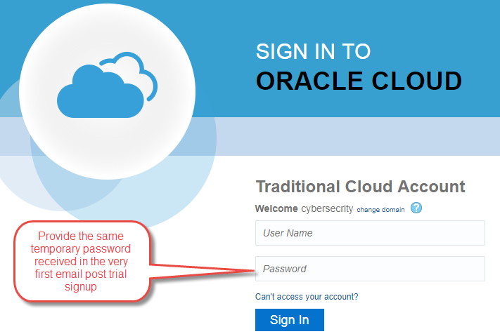

1. Create a new password and provide challenge Q&A for resetting should you ever need to.

	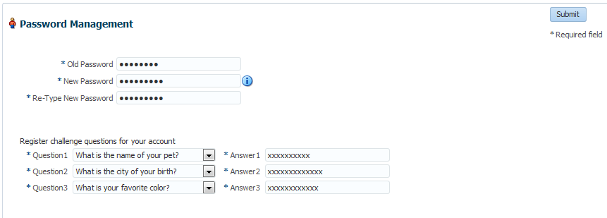

1. You’re are now ready to start using any of the services shown below. Our focus with be narrowed to “Security Monitoring and Analytics”

	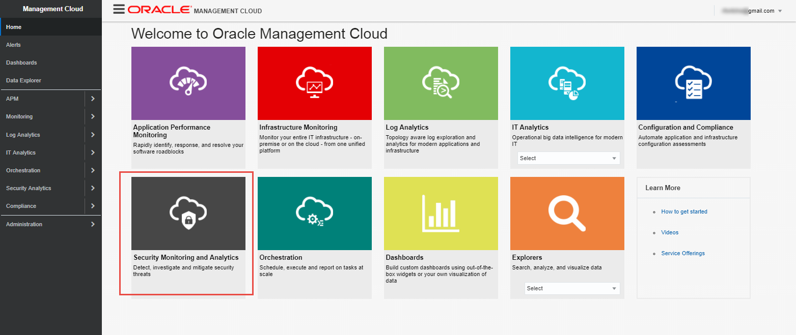
	
### Instance Configuration

Prior to using the new service the following minimum configuration:
1. Enable Security Monitoring & Analytics
1. SMA alert rules

#### Enabling Security Monitoring Analytics

1. Navigate to `Menu Icon` -> `Home` -> `Administration` -> `Entities Configuration` -> `Licensing`

	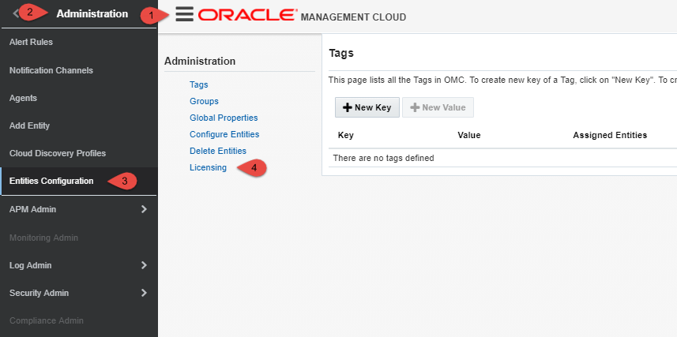

1. Click on “DISABLED” under “SMA Enrichment”

	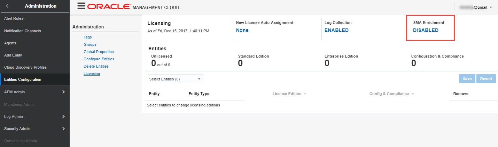
	
1. Push selector for “Enable Security Monitoring and Analytics” to the right and click “Apply” to enable

	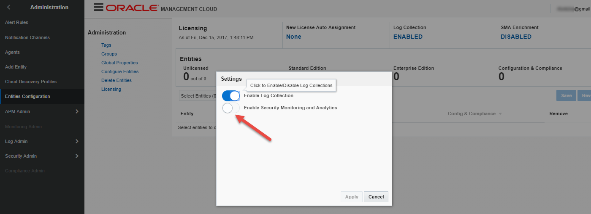
	
1. Enable New License Auto-Assignment by Clicking on "None"

	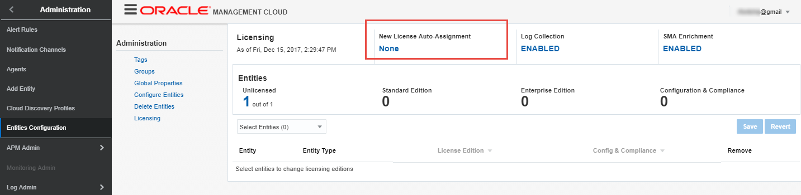
	
1. Toggle selector as shown below and click “Apply”	

	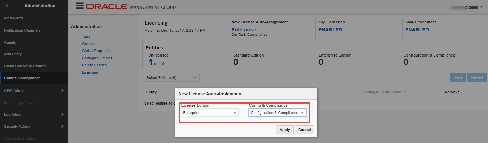
	
#### Create Security Monitoring & Analytics-based Alert(s)

1. Navigate `Menu Icon` -> `Home` -> `Administration` -> `Alert Rules` and Select “Security Analytics” from the Drop-Down Menu

	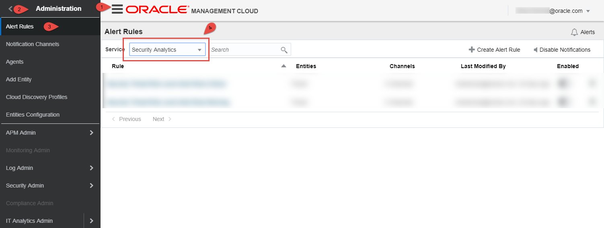

1. Click on “Create Alert Rule”

	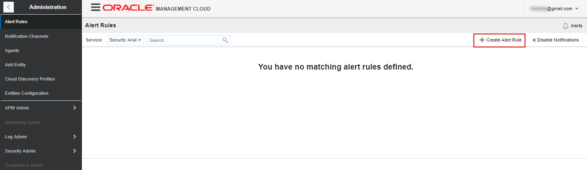

1. Follow the steps provided below to create the “Warning” alert rule. Fill in the form as shown below and click “+ Email Channel” 

	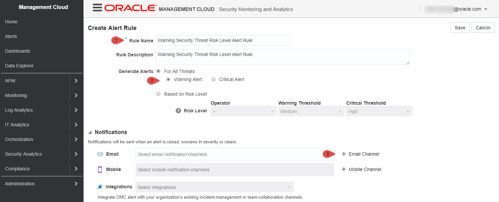

1. Fill in the form as shown below, click “Create” to add your first “Email Channel”, then click “Save” to create the “Warning” alert rule

	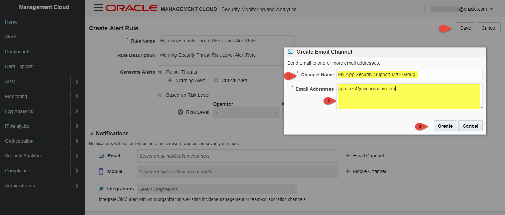

1. Optionally repeat step above and create the “critical” rule by switching from warning to critical

	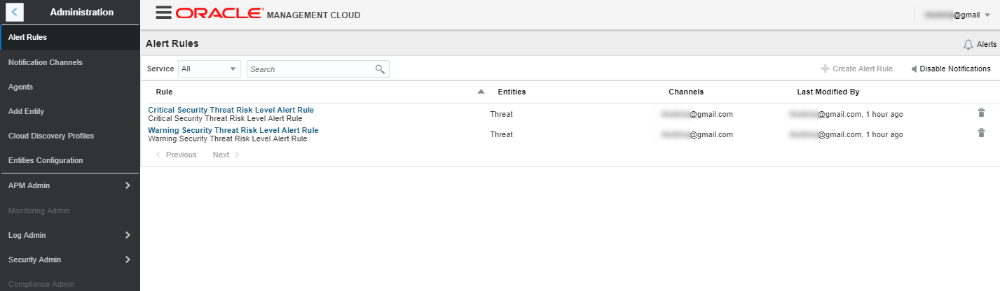

### Review Correlation Rules for Evaluating Threats

1. Login to your OMC instance and select the SMA service

	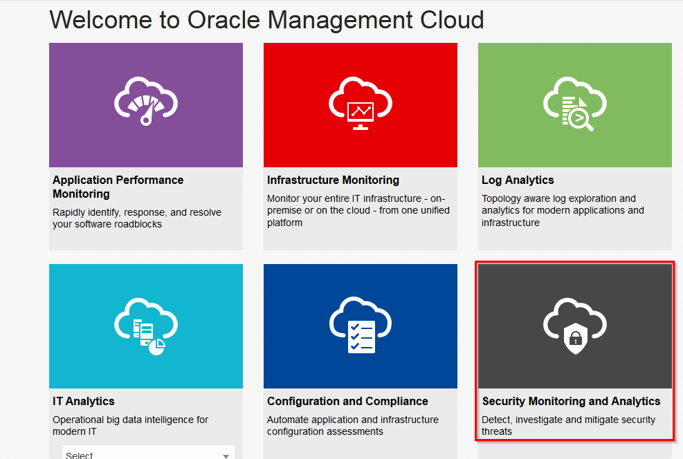

1. Click the ‘Menu Icon’ to the left of Oracle logo in the top left of your window to access the menu
1. Click on Security Admin

	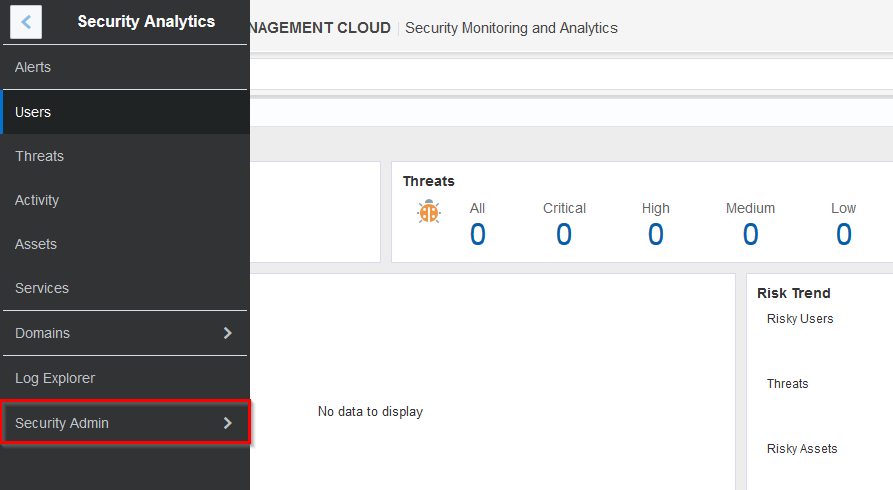

1. Click on Correlation Rules

    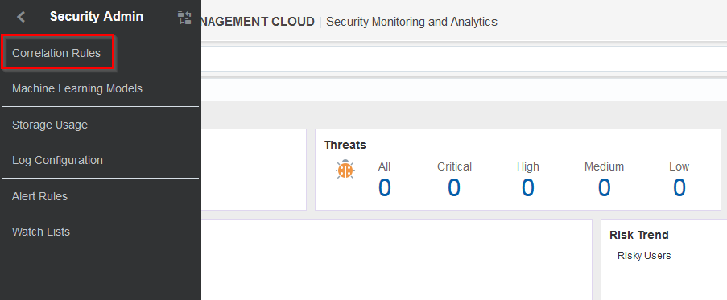
	
1. On the Correlation Rules screen, take a moment to explore some of the built-in correlation rules available within SMA for the purposes of threat detection. In today’s lab we will exercise three threats under the Host category

   - Host `<-- Targeted Account Attack`
   - Host `<-- Multiple Failed Logins`
   - Host `<-- Brute Force Attack`

6. Click on each one in turn and review the Definition as well as the Parameters available 

    
	
1. Access the sidebar menu again, and click on the back arrow in the sidebar menu, then select Log Explorer
1. Access the sidebar menu, select Log Admin -> Uploads

	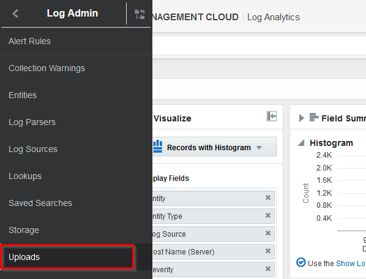
	
1. For the moment, this page should be empty. In the next section, we will upload all relevant files and then return to this screen to review our uploads and check associated log data and then Activity in SMA

## STEP 2 - On-Demand Security Logs Data Upload

There are multiple methods for getting data into your environment, the most common methods are installing Cloud Agents directly on the source machines in question or using the ODU method. For this lab, we will be using the ODU method. 

### Connecting to the Linux Host to Upload Test Data

On the shared Linux Server, you will find the sample data and upload scripts for the lab under /u01/stage. The host IP address and credentials will be provided by the instructor before the lab. 

1.	Obtain the Linux server IP address and password from the instructor
1.	Using your preferred SSH utility from your laptop, login with OS username "cdsma"

### Adding User Context to OMC

In addition to log data, sample user context data will be added to OMC as well to provide a richer experience by mapping users identified in security logs to detailed corporate directory sourced from the company’s Identity Service. In real production setting, this data will come from an Identity Service such as IDCS and by means of integration.

1.	In your SSH session, navigate to /u01/stage 
1.	From [My Cloud Services Dashboard](https://myservices.us2.oraclecloud.com/mycloud/cloudportal/dashboard), toggle "Identity Domain" selector to your "Traditional" domain, then click on `Management Cloud` as shown below

	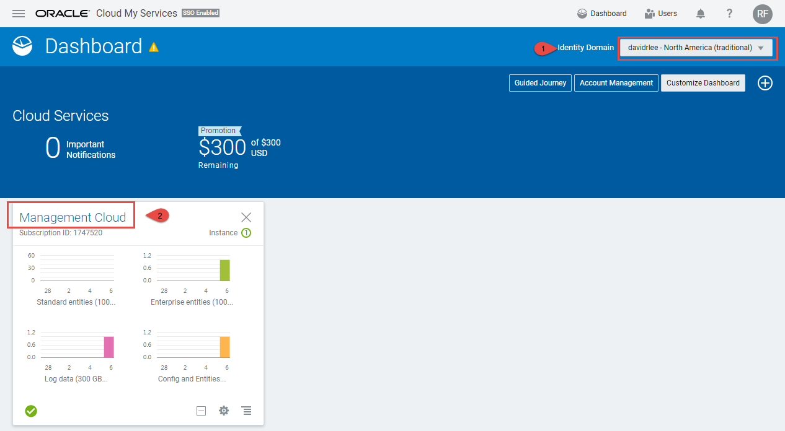

1.	Get the Tenant ID, OMC Service Instance Name, and OMC Username as shown below

	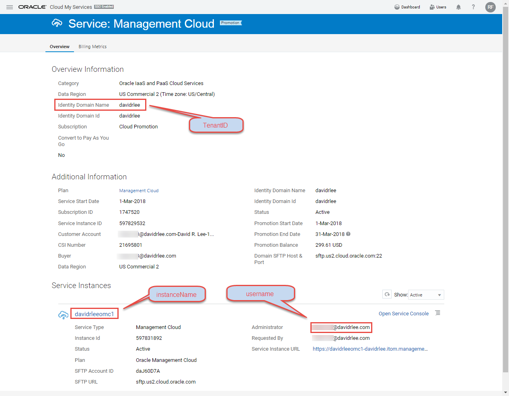
	
1. 	Using the items gathered above, update environment variables accordingly as shown in this example

```
export tenantID=acmeinc			#Tenant ID
export instanceName=ops			#OMC Service Instance Name
export username=John.Doe@gmail.com	#OMC Username
```
3.	Execute the Unix shell script `omc_upload_usr_context.sh` and type in your OMC account password when prompted to upload User context file

```
[cdsma@myhost]$ ./omc_upload_usr_context.sh
```

### Uploading Linux Secure Logs to OMC

For the benefit of this lab, you will be uploading sample Linux Secure logs files to OMC covering the following 3 security threats types:

   - `Target Account Attack `
   - `Multiple Failed Login `
   - `Brute Force Attack `

In real production setting, this data will be continuously streamed to OMC by OMC cloud agents and API integration. SMA supports uploading user data available in SCIM or LDIF format. The former will be used.

1.	From the same Linux host as indicated earlier and still with the environment variables set, run the Unix shell script `omc_upload_security_events.sh` to upload Linux secure logs. 

```
[cdsma@myhost]$ ./omc_upload_security_events.sh
```

## STEP 3 - Visualization - Review Log Data and Threat Activities

Once you have successfully uploaded the three log files, navigate back to the Uploads page. Refresh the page to see your uploaded log files.

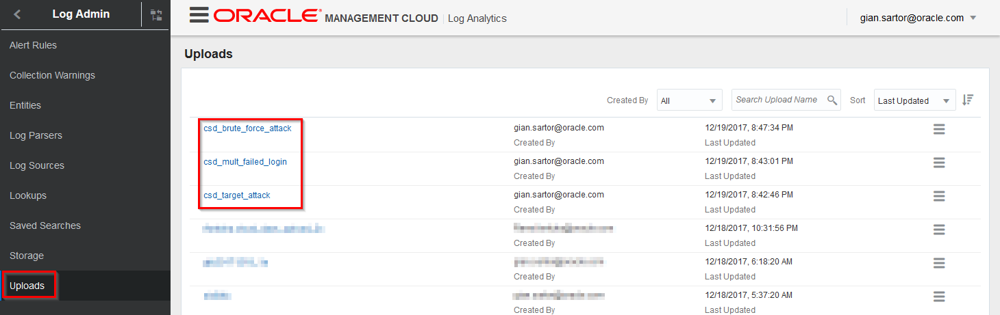
    
### Review Log Data and Threat Activities in OMC

The data uploaded provides insights into key steps that make up what is known as a `Kill Chain`: `Anomaly Detection` ==> `Reconnaissance` ==> `Infiltration` ==> `Lateral Movement`.

#### Assess Linux Targeted Account Attack Data
You may recall that the definition of a Targeted Account Attack is *5 or more failed login events associated with the same user account are detected within an interval of 60 seconds across single or multiple endpoints* from the Correlation Rules page we review earlier.

1. Switch to your SSH session and open the linux_ta_attack.log file
   - `[gsartor@lux sample-logs]$ less linux_ta_attack.log`
   - Note the hostnames for `hr1` and `finance1` as well as the value for `rhost` and `user`
   - Note how many records are in this file (12)
 
	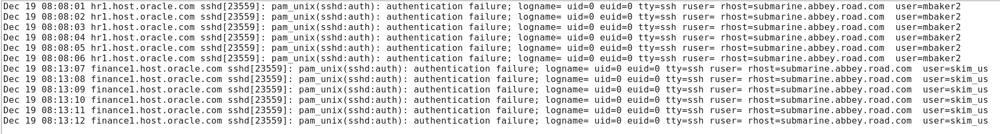

2. Switch back to your browser and to the Uploads page. Click the ‘Menu Icon’ in the csd_target_attack row and select View in Log Explorer

	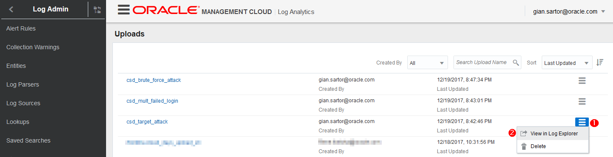

1. You are now viewing the log data in OMC Log Analytics. Security relevant data flowing to SMA goes through LA where it is enriched with security relevant tags. Note the filter being applied in the page as well as the number of relevant events (12).

	

1. In the sidebar menu, click the back button in the top left-hand corner and select Security Analytics from the service list.
1. Toggle the timeframe selector in the upper righ-hand corner, set it to "12/18/2017 - 12/20/2017", then return to the sidebar menu and click on `Activity` to get a high-level overview of relevant security activities detected in your environment during that timeframe

	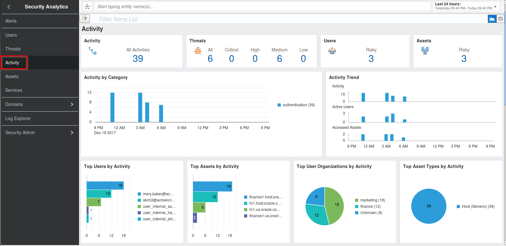

1. Scroll further down the same page to view a list of the activities

	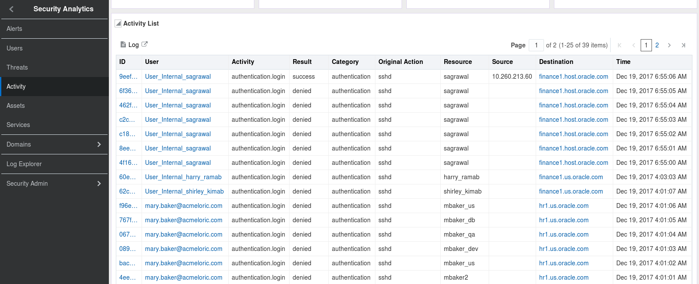

1. Click Threats in the sidebar menu, then click the number under All in the Threats section

	

1. Scroll down to the bottom of the page and review the threat details. Note the Correlation Rule value as well as the Category type of ‘infiltration’ and the accounts being targeted.

	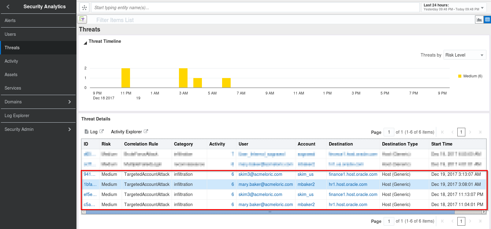

1. Now let’s repeat this process for the Multiple Failed Login and Brute Force Attack log files

#### Assess Multiple Failed Logins Data

Before reviewing the files, lets remind ourselves of the definition for Multiple Failed Login Correlation Rule, *5 or more failed login events are detected on multiple accounts on the same endpoint, within a time interval of 60 seconds*

1. Switch to your SSH session and open the linux_mfl_attack.log file

   - `[gsartor@lux sample-logs]$ less linux_mfl_attack.log`
   - On this occasion, each failed login is for a different username. This is different from the Targeted User Attack we covered in the previous section.
   - Note how many records are in this file (8)

	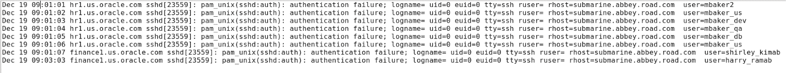

2. Switch back to your browser and to the Uploads page. Click the ‘Menu Icon’ in the csd_multi_failed_login row and select View in Log Explorer

	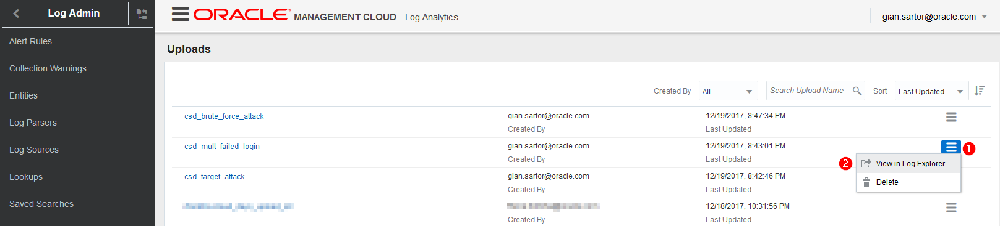

1. We are now back in Log Analytics and again take note of the filter being applied to the data we are viewing as well as the number of records being displayed. This matches the number of logs in our source file

	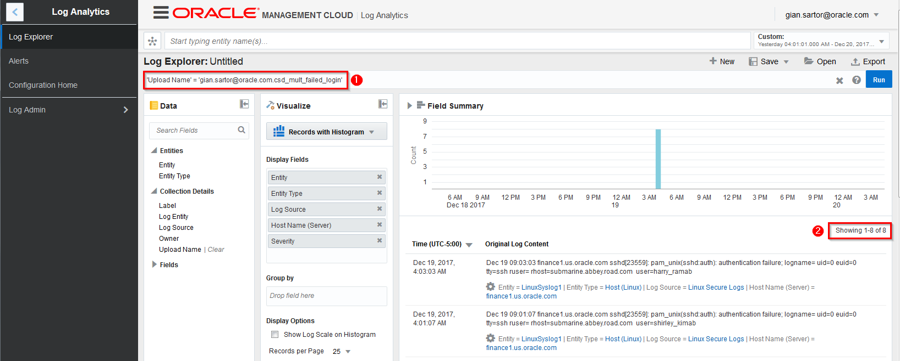

1. This time lets go straight to the Threats page in SMA. Once you are at the Threats page, click on the number below All in the Threats section.

	

1. In the Threat Details section, locate the MultipleFailedLogin and click the ID

	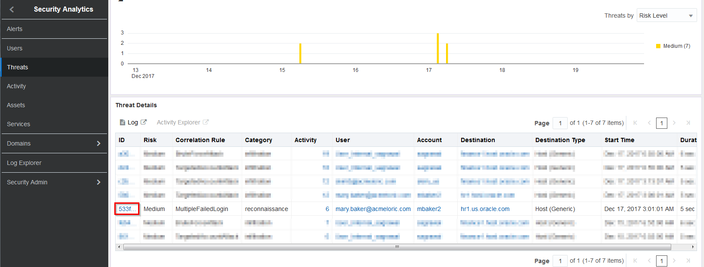

1. On the new Threat Details page, you now have access to a lot of detailed information for this specific threat. You can see the Category, Start and End time of this activity, the account being used for the attack as well as which Department that account belongs to, in this case Marketing. This departmental information came from our User Context Upload. Lastly, note the various usernames in the Resource column; the same as the ones in the upload file.

	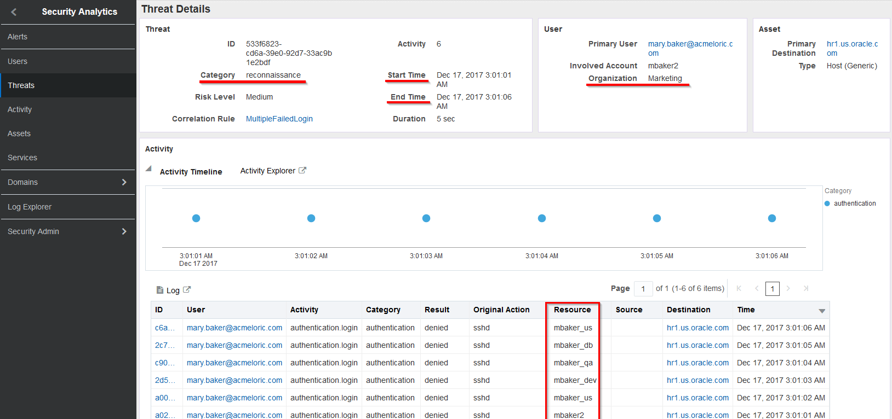

#### Assess Brute Force Attack Data

Finally, in this last section, we will assess the activity for a Brute Force Attack. Described as *5 or more failed login events are followed by a successful login on the same endpoint, associated with the same user account, within an interval of 60 seconds*.

1. Let’s return for the last time the SSH session and review the upload file for the Brute Force Attack. Switch to your SSH session and open the linux_bfa_attack.log file

   - `[gsartor@lux sample-logs]$ less linux_bfa_attack.log`
   - Note the timing of the events, note that only one user is being targeted and lastly, note that we have a successful login on the last line
   - Note how many records are in this file (7)

	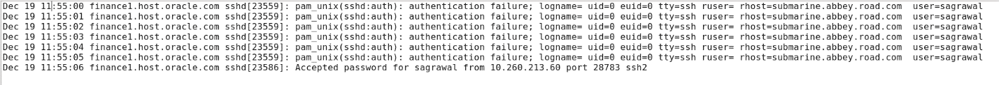

2.	Switch back to your browser and to the Uploads page. Click the ‘Menu Icon’ in the csd_brute_force_attack row and select View in Log Explorer

	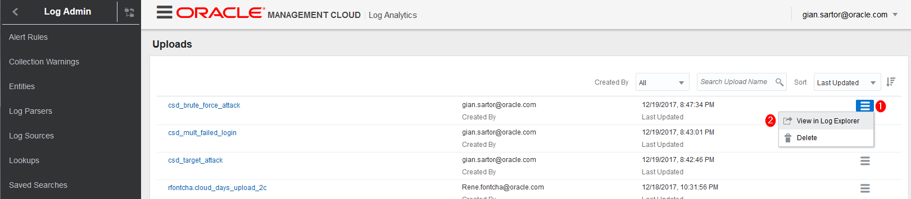

1.	Back in Log Analytics and again take note of the filter being applied to the data we are viewing as well as the number of records being displayed. This matches the number of logs in our source file

	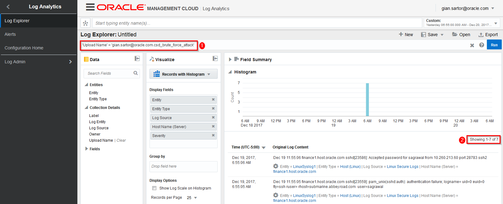

1.	Once again, we’ll go straight to the Threats page in SMA. Once you are at the Threats page, click on the number below All in the Threats section.

	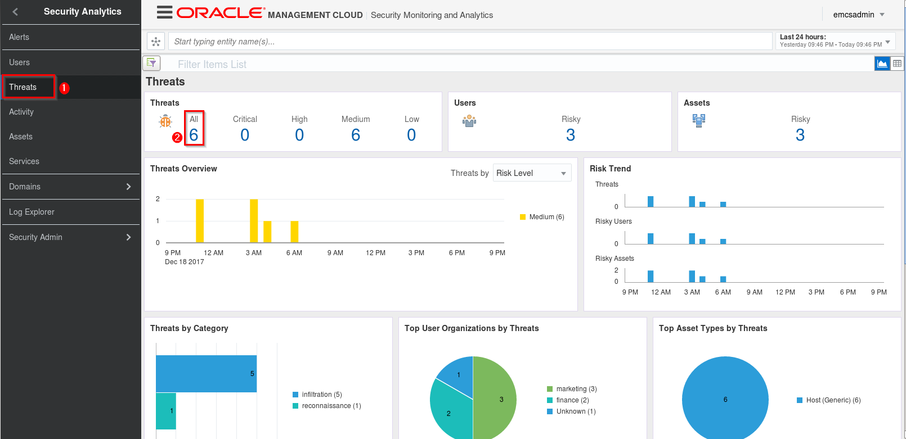

1.	In the Threat Details section, locate the BruteForceAttack and click the ID

	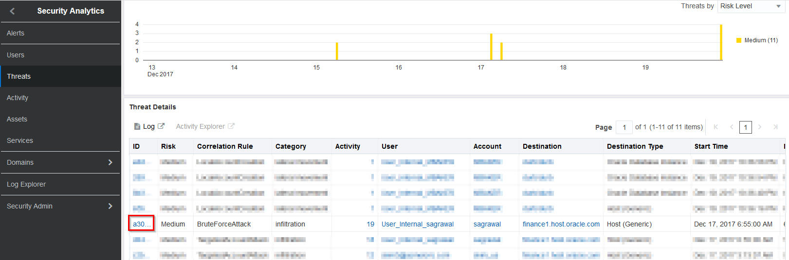

1.	Take a few moments to review the details on the page, noting most importantly that we have many failed logins followed by a successful login.

	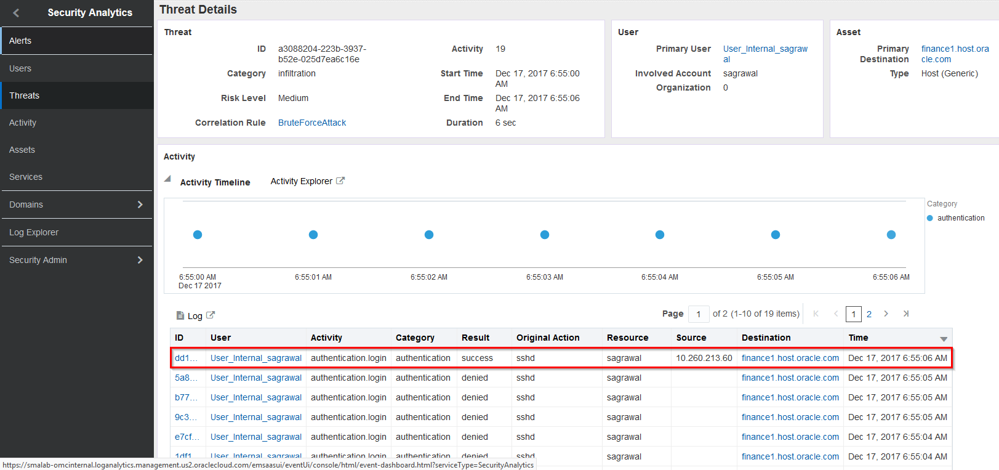

This concludes the threat assessment portion of this lab.

### Review alert emails

In case you haven’t already noticed, you should have received some alert emails based on the activity we have been generating over the course of this lab.

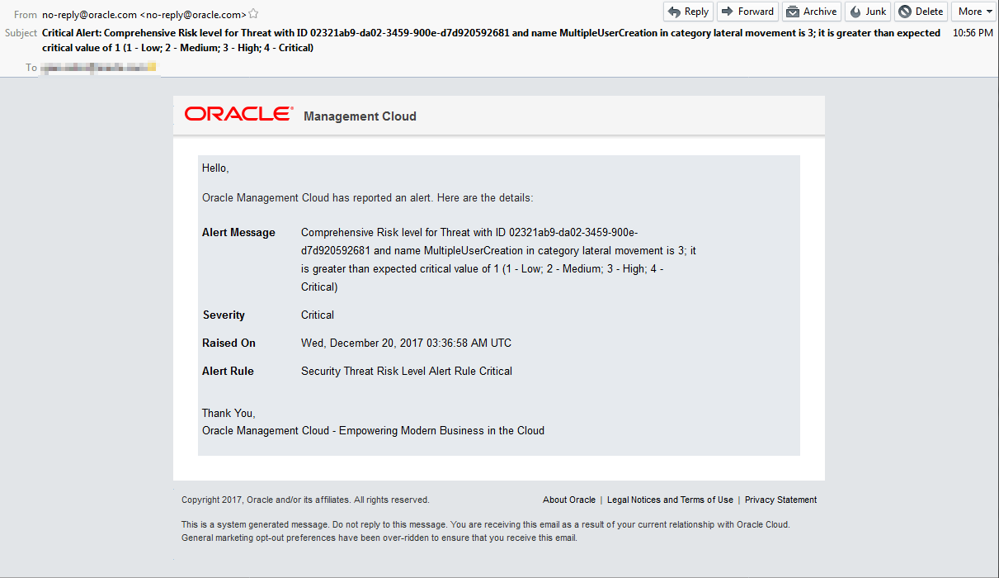

## Summary

In this lab, we:

   - Setup alerts
   - Reviewed Correlation Rules in SMA
   - Uploaded data to your environment
   - Assessed the threats associated with the data uploads
   - Navigated through the user interface of both the Log Analytics Cloud Service as well as the Security Monitoring & Analytics Cloud Service
   - We saw how SMA categorizes threats and how we can enrich the log data with user context
   - Understood what comprises a kill chain and why that is important
   - Reviewed alert emails
